# **Item Insight**

**Pemrograman Berbasis Platform**<br/>
Shanti Yoga Rahayu<br/>
2206082360<br/>
PBP D<br/>


# **Tugas 2: Implementasi Model-View-Template (MVT) pada Django**<br/>

<details open>
  <summary>Tugas 2</summary>

<br/>
Tautan menuju aplikasi Adaptable yang sudah melalui tahap deployment dapat diakses melalui [link ini](https://item-insight.adaptable.app/main/).

## **Membuat Sebuah Proyek Django Baru**
1. Buat sebuah direktori baru sesuai dengan nama yang diinginkan, contohnya `item_insight`. 
2. Di dalam direktori tersebut, buka *command prompt* (Windows) atau *terminal shell* (Linux/Mac).
3. Buat *virtual environment* Python untuk mengisolasi package serta dependencies dari aplikasi sehingga tidak bertabrakan dengan versi lain yang terdapat pada komputer dengan menggunakan perintah berikut.
```
python -m venv env 
```
4. Aktifkan *virtual environment* yang telah dibuat dengan menggunakan perintah berikut. *Virtual environment* yang telah aktif akan ditandai dengan `(env)` pada baris input terminal.
- Windows
```
env\Scripts\activate.bat
```
- Linux/Mac
```
source env/bin/activate
```

5. Buat file `requirements.txt`  di dalam direktori proyek yang sama dan tambahkan daftar *dependencies* yang dibutuhkan dalam file tersebut. Berikut *dependencies* yang akan digunakan dalam proyek.

```txt
django
gunicorn
whitenoise
psycopg2-binary
requests
urllib3
```

6. Install *dependencies* tersebut pada `requirements.txt` dengan menjalankan perintah berikut.
```
python -m pip install -r requirements.txt
```

7. Buat proyek Django dengan nama `item_insight` menggunakan perintah berikut.
```
django-admin startproject item_insight .
```

8. Tambahkan `*` pada `ALLOWED_HOSTS` yang terdapat di dalam `settings.py` yang berada di dalam direktori `item_insight` untuk mengizinkan akses dari semua host. Perlu diingat untuk menggunakan pengaturan ini dengan bijak dan hanya dalam situasi tertentu, seperti saat melakukan uji coba atau tahap awal pengembangan
```python
...
ALLOWED_HOSTS = ["*"]
...
```

9. Pastikan bahwa berkas 'manage.py' terdapat pada direktori yang aktif pada shell kamu saat ini. Di dalam direktori utama, buka kembali *command prompt* atau *terminal shell*. Jalankan server dengan perintah berikut.
```
python manage.py runserver
```

10. Akses http://localhost:8000 di peramban web untuk melihat animasi roket yang menandakan bahwa pembuatan aplikasi Django telah berhasil.
11. Hentikan server dapat dilakukan dengan menekan tombol `Ctrl+C` pada *command prompt* atau *terminal shell*. 
12. Nonaktifkan *virtual environment* dengan menggunakan perintah `deactivate`.
> [!NOTE]
> Buat `.gitignore` yang berisi file yang tidak diperlukan agar tidak memenuhi space.
Isi dari `.gitignore` adalah sebagai berikut.

```.gitignore
# Django
*.log
*.pot
*.pyc
__pycache__
db.sqlite3
media

# Backup files
*.bak 

# If you are using PyCharm
# User-specific stuff
.idea/**/workspace.xml
.idea/**/tasks.xml
.idea/**/usage.statistics.xml
.idea/**/dictionaries
.idea/**/shelf

# AWS User-specific
.idea/**/aws.xml

# Generated files
.idea/**/contentModel.xml

# Sensitive or high-churn files
.idea/**/dataSources/
.idea/**/dataSources.ids
.idea/**/dataSources.local.xml
.idea/**/sqlDataSources.xml
.idea/**/dynamic.xml
.idea/**/uiDesigner.xml
.idea/**/dbnavigator.xml

# Gradle
.idea/**/gradle.xml
.idea/**/libraries

# File-based project format
*.iws

# IntelliJ
out/

# JIRA plugin
atlassian-ide-plugin.xml

# Python
*.py[cod] 
*$py.class 

# Distribution / packaging 
.Python build/ 
develop-eggs/ 
dist/ 
downloads/ 
eggs/ 
.eggs/ 
lib/ 
lib64/ 
parts/ 
sdist/ 
var/ 
wheels/ 
*.egg-info/ 
.installed.cfg 
*.egg 
*.manifest 
*.spec 

# Installer logs 
pip-log.txt 
pip-delete-this-directory.txt 

# Unit test / coverage reports 
htmlcov/ 
.tox/ 
.coverage 
.coverage.* 
.cache 
.pytest_cache/ 
nosetests.xml 
coverage.xml 
*.cover 
.hypothesis/ 

# Jupyter Notebook 
.ipynb_checkpoints 

# pyenv 
.python-version 

# celery 
celerybeat-schedule.* 

# SageMath parsed files 
*.sage.py 

# Environments 
.env 
.venv 
env/ 
venv/ 
ENV/ 
env.bak/ 
venv.bak/ 

# mkdocs documentation 
/site 

# mypy 
.mypy_cache/ 

# Sublime Text
*.tmlanguage.cache 
*.tmPreferences.cache 
*.stTheme.cache 
*.sublime-workspace 
*.sublime-project 

# sftp configuration file 
sftp-config.json 

# Package control specific files Package 
Control.last-run 
Control.ca-list 
Control.ca-bundle 
Control.system-ca-bundle 
GitHub.sublime-settings 

# Visual Studio Code
.vscode/* 
!.vscode/settings.json 
!.vscode/tasks.json 
!.vscode/launch.json 
!.vscode/extensions.json 
.history
```

## **Membuat Aplikasi dengan Nama Main Pada Proyek Item Insight**
1. Buka command prompt pada direktori utama `item_insight`.
2. Aktifkan virtual environment dengan perintah berikut.
```
env\Scripts\activate.bat
```
2. Buat aplikasi main dengan perintah berikut sehingga terbentuk direktori baru dengan nama main yang akan berisi struktur awal untuk aplikasi.
```
python manage.py startapp main
```
3. Daftarkan aplikasi main ke proyek dengan membuka berkas `settings.py` dalam direktori proyek `item_insight` dan tambahkan `'main'` pada variabel INSTALLED_APPS.
```
INSTALLED_APPS = [
    ...,
    'main',
    ...
]
```

> [!NOTE]
> Proses routing dijelaskan sekaligus di bawah.

## **Membuat Model Pada Aplikasi `Main` dengan Nama Item dan Memiliki Atribut**
1. Buka berkas `models.py` pada direktori aplikasi `main`.
2. Ubah file `models.py` yang terdapat di dalam direktori aplikasi `main` tersebut untuk mendefinisikan model dengan nama `ItemStore` dan memiliki atribut wajib sebagai berikut.
* `name` sebagai nama item dengan tipe `CharField`.
* `amount` sebagai jumlah item dengan tipe `IntegerField`.
* `description` sebagai deskripsi item dengan tipe `TextField`.<br/>
Tambahkan atribut lainnya sesuai dengan apa yang diinginkan, seperti `price` dan `category`. 
2. Isi file `models.py` dengan kode berikut.
```python
from django.db import models

class ItemStore(models.Model):
    name = models.CharField(max_length=255)
    amount = models.IntegerField()
    description = models.TextField()
    price = models.BigIntegerField()
    category = models.CharField(max_length=255)
```

3. Jalankan perintah `python manage.py makemigrations` untuk membuat migrasi model. `makemigrations` akan membuat berkas migrasi yang berisi perubahan model yang belum diaplikasikan ke dalam basis data.

4. Jalankan perintah `python manage.py migrate`.`migrate` akan mengaplikasikan perubahan model yang tercantum dalam berkas migrasi ke basis data.

> [!IMPORTANT]
> Setiap kali melakukan perubahan pada model, seperti menambahkan atau mengubah atribut, perlu melakukan migrasi untuk merefleksikan perubahan tersebut.

## **Membuat Sebuah Fungsi Pada `views.py` untuk Dikembalikan ke Dalam Sebuah Template HTML**
1. Buat direktori baru dengan nama `templates` di dalam direktori aplikasi `main`.
2. Buka direktori `templates` yang telah dibuat. Di dalam direktori tersebut buat file baru dengan nama `main.html`.
3. Buka file `views.py` yang terdapat di dalam direktori `main` dan tambahkan baris kode berikut di bagian paling atas. Kode berikut berguna untuk mengimpor *fungsi render* dari modul `django.shortcuts` yang akan digunakan dalam proses rendering tampilan HTML dengan menggunakan data yang diberikan.
```
`from django.shortcuts import render`. 
```
3. Buat fungsi `show_item` dengan parameter `request` yang di dalamnya terdapat sebuah dictionary `context`. Dictionary `context` berisikan data yang akan dikirimkan ke tampilan. Selanjutnya, tambahkan fungsi `render` yang memiliki tiga argumen, yaitu `request` (objek permintaan HTTP yang dikirim oleh pengguna), `"main.html"` (nama file HTML yang akan digunakan untuk proses *rendering* tampilan), dan `context` (dictionary yang berisi data untuk digunakan dalam tampilan yang dinamis). Fungsi ini akan mengatur permintaan HTTP dan mengembalikan dengan tampilan yang sesuai.

```python
from django.shortcuts import render

def show_item(request):
    context = {
        'creator' : 'Shanti Yoga Rahayu',
        'id' : 2206082360,
        'class' : 'PBP D',
        'name': 'Peony',
        'amount': 52,
        'description': 'The peony is a lush and extravagant flowering plant known for its large, fragrant, and beautifully layered blooms in a variety of colors, making it a symbol of romance and prosperity.',
        'price': 57000,
        'category':'Flower'
    }

    return render(request, 'main.html', context)
```

4. Buka file `main.html` yang sebelumnya telah dibuat dan ubah pada kode yang sebelumnya dibuat secara statis menjadi kode Django yang sesuai sehingga dapat menampilkan data. Gunakan sintaks Django `{{ }}` untuk menampilkan data dari variabel yang terdapat dalam `context` yang telah dikirimkan oleh fungsi `show_item`.

## **Membuat Sebuah Routing Pada `urls.py` Aplikasi `main` untuk Memetakan Fungsi yang Telah Dibuat pada `views.py`**
1. Buat file `urls.py` di dalam direktori main.
2. Konfigurasi routing URL aplikasi `main` agar aplikasi main dapat diakses melalui peramban web dengan melakukan perubahan pada file `urls.py` yang berada dalam direktori `main`.

```python
from django.urls import path
from main.views import show_item

app_name = 'main'

urlpatterns = [
    path('', show_item, name='show_item'),
]
```
## **Melakukan Routing Pada Proyek agar Dapat Menjalankan Aplikasi `main`**
Agar aplikasi yang dibuat dapat dijalankan, diperlukan konfigurasi routing proyek. 
1. Buka berkas `urls.py` di dalam direktori proyek. 
2. Tambahkan rute yang mengarah ke aplikasi tersebut di dalam file `urls.py` yang berada di dalam direktori proyek.
```
"""
URL configuration

The `urlpatterns` list routes URLs to views. For more information please see:
    https://docs.djangoproject.com/en/4.2/topics/http/urls/
Examples:
Function views
    1. Add an import:  from my_app import views
    2. Add a URL to urlpatterns:  path('', views.home, name='home')
Class-based views
    1. Add an import:  from other_app.views import Home
    2. Add a URL to urlpatterns:  path('', Home.as_view(), name='home')
Including another URLconf
    1. Import the include() function: from django.urls import include, path
    2. Add a URL to urlpatterns:  path('blog/', include('blog.urls'))
"""
from django.contrib import admin
from django.urls import path, include

urlpatterns = [
    path('admin/', admin.site.urls),
    path('main/', include('main.urls')),
]
```

## **Melakukan Deployment ke Adaptable**
1. Akses link [Adaptable.io](https://adaptable.io/) melalui peramban web, kemudian buat akun [Adaptable.io](https://adaptable.io/) dengan menggunakan akun GitHub yang digunakan untuk membuat proyek.
2. Setelah berhasil masuk ke [Adaptable.io](https://adaptable.io/), tekan tombol `New App`dan pilih *option* `Connect an Existing Repository`.
3. Hubungkan [Adaptable.io](https://adaptable.io/) dengan GitHub dengan memilih `All Repositories` pada proses instalasi.
4. Pilih repositori proyek aplikasi yang telah berhasil diunggah ke GitHub sebagai basis aplikasi yang akan dilakukan proses *deployment* dan branch yang ingin dijadikan sebagai deployment branch..
5. Pilih `Python App Template` sebagai template deployment.
6. Pilih `PostgreSQL` sebagai tipe basis data yang akan digunakan.
7. Sesuaikan versi Python dengan spesifikasi aplikasi yang akan dilakukan proses `deployment`. Nyalakan virtual environment dan jalankan perintah `python --version` untuk mengecek versi Python yang terdapat pada komputer.
8. Pada bagian `Start Command`, jalankan perintah `python manage.py migrate && gunicorn (main directory).wsgi`.
9. Masukkan nama aplikasi yang nantinya juga akan menjadi nama domain situs web aplikasi sesuai keinginan.
10. Centang bagian `HTTP Listener on PORT` dan tekan tombol `Deploy App` untuk memulai proses *deployment* aplikasi.

## **Bonus: Testing**
1. Buat file testing tambahan pada file `tests.py`.
```python
from django.test import TestCase, Client

class mainTest(TestCase):
    def test_main_url_is_exist(self):
        response = Client().get('/main/')
        self.assertEqual(response.status_code, 200)

    def test_main_using_main_template(self):
        response = Client().get('/main/')
        self.assertTemplateUsed(response, 'main.html')

    def test_item_store_create(self):
        item = ItemStore.objects.create(
            name= 'Peony',
            amount= 52,
            description= 'The peony is a lush and extravagant flowering plant known for its large, fragrant, and beautifully layered blooms in a variety of colors, making it a symbol of romance and prosperity.',
            price= 57000,
            category='Flower',
        )
        self.assertEqual(item.name, 'Peony')
        self.assertEqual(item.amount, 52)
        self.assertEqual(item.description, 'The peony is a lush and extravagant flowering plant known for its large, fragrant, and beautifully layered blooms in a variety of colors, making it a symbol of romance and prosperity.',)
        self.assertEqual(item.price, 57000)
        self.assertEqual(item.category, 'Flower')
```
2. Jalankan tes dengan menggunakan perintah berikut.
```
python manage.py test
```
3. Contoh dari *unit testing* yang berhasil dilakukan sebagai berikut.

```
Found 3 test(s).                                 
Creating test database for alias 'default'...
System check identified no issues (0 silenced).
...
----------------------------------------------------------------------
Ran 3 tests in 0.055s

OK
Destroying test database for alias 'default'...```
```

Berikut penjelasan singkat tentang terkait kode tersebut:

1. `test_main_url_is_exist`:
   - Fungsi ini bertujuan untuk memeriksa apakah URL `/main/` dalam aplikasi dapat diakses dengan benar (status code 200). 
   - Langkah-langkah yang digunakan adalah dengan membuat objek `Client()` yang digunakan untuk membuat permintaan HTTP simulasi, menggunakan objek `Client()` untuk melakukan permintaan GET ke URL `/main/`, dan memeriksa apakah respons dari permintaan tersebut memiliki status kode 200 (OK).

2. `test_main_using_main_template`:
   - Fungsi ini bertujuan untuk memastikan bahwa saat mengakses URL `/main/`, template yang digunakan adalah `main.html`. Langkah-langkah yang digunakan adalah membuat objek `Client()` yang digunakan untuk membuat permintaan HTTP simulasi, menggunakan objek `Client()` untuk melakukan permintaan GET ke URL `/main/`, dan memeriksa apakah template yang digunakan dalam respons sesuai dengan `main.html`.

3. `test_item_store_creation`:
   - Fungsi ini bertujuan untuk menguji pembuatan objek `ItemStore` dengan nilai-nilai yang ditentukan.
   - Langkah-langkah yang digunakan adalah membuat objek `ItemStore` dengan atribut-atribut yang telah ditentukan seperti `name`, `amount`, `description`, `price`, dan `category`. Langkah selanjutnya adalah memeriksa apakah atribut-atribut objek `ItemStore` sesuai dengan nilai-nilai yang telah diatur.

*Unit test* ini dapat digunakan untuk memastikan bahwa URL `/main/` dapat diakses dengan benar, bahwa template `main.html` digunakan, dan bahwa objek `ItemStore` dapat dibuat dengan benar sesuai dengan nilai-nilai yang diinginkan. *Unit testing* berguna untuk memastikan bahwa kode yang dibuat dapat berfungsi dengan benar dan menghindari adanya bug yang tidak terdeteksi.

## **Bagan Client Request and Response - Django**

Berikut ini adalah penjelasan bagan di atas:
1. Pengguna *(client)* membuka peramban web untuk mengunjungi situs web.
2. Pengguna *(client)* masuk ke situs web dan *web server* melayani permintaan *(request)* dari pengguna *(client)*.
3. WSGI melakukan pemrosesan server HTTP untuk situs web yang menggunakan bahasa pemrograman Python.
4. Middleware berperan sebagai perantara untuk mengintegrasikan teknologi yang digunakan dalam proyek untuk mengelola permintaan *(request)*.
5. URL Router mengarahkan alamat proyek sesuai dengan permintaan *(request)* dari pengguna *(client)* yang didefinisikan dalam `urls.py` dan kemudian mengarahkannya ke fungsi yang terdapat di dalam `views.py`.
6. Views (views.py) bertanggung jawab untuk mengatur isi yang akan ditampilkan dalam template HTML. Data yang diolah diambil dari basis data yang telah diorganisir dengan menggunakan ORM dalam `models.py`.
7. Context processor mengirimkan data berisikan informasi dari views.py ke dalam template HTML.
8. Template HTML menampilkan *interface* proyek sesuai dengan data konteks yang dikirimkan dari views.py dan mengikuti logika yang diatur oleh template tags.
9. Middleware berperan sebagai perantara untuk mengintegrasikan teknologi yang diterapkan dalam proyek untuk mengelola *response*.
10. WSGI melakukan pemrosesan server HTTP untuk situs web yang menggunakan bahasa pemrograman Python.
11. Web server melayani *response* dari server dan mengirimkannya ke pengguna *(client)*.
12. Pengguna *(Client)* menerima hasil *response* yang dikirimkan oleh web server.

## **Penjelasan Mengapa Kita Perlu Menggunakan *Virtual Environment*?**
*Virtual environment* adalah sebuah *tool* yang diperlukan untuk memisahkan dependensi yang diperlukan oleh proyek berbeda dengan membuat lingkungan virtual Python terisolasi untuk proyek tersebut. Python kurang baik dalam manajemen *dependency* sehingga apabila perintah kurang spesifik, maka pip akan menginstal semua paket eksternal ke dalam direktori yang disebut 'site-packages' dalam instalasi dasar Python. Dengan menggunakan *virtual environment*, maka dependensi untuk setiap proyek tidak akan saling bersinggungan atau saling mengganggu sehingga dapat meminimalisir konflik dan masalah kompatibilitas yang mungkin terjadi.

*Virtual environment* juga membantu pihak *developer* dalam mengelola dependensi proyek secara lebih efisien. *Developer* dapat menggunakan file `requirements.txt` yang berisi daftar dependensi yang diperlukan dari suatu proyek yang dijalankan dalam *virtual environment* tertentu agar pihak yang terlibat dalam proyek tersebut dapat mengetahui daftar dependesi yang diperlukan dengan mudah dan konsisten. Contohnya, sebuah platform hosting seperti `Adaptable` dapat secara otomatis mengidentifikasi dependensi yang dibutuhkan untuk menjalankan server melalui file `requirements.txt`.  Hal ini juga memberikan kemudahan dalam pengelolaan repositori, di mana pengguna tidak perlu melakukan push direktori    `virtual environment` yang dapat menghabiskan banyak ruang penyimpanan dalam repositori atau host karena semua dependensi telah tercatat dengan jelas dalam berkas `requirements.txt` dan dapat diabaikan dengan menggunakan file .gitignore.


Sebagai contoh, sebuah mesin host seperti `Adaptable` dapat mengetahui dependensi yang harus digunakan untuk menjalankan server melalui file `requirements.txt`. Akan tetapi, *virtual environment* umumnya memerlukan cukup banyak ruang penyimpanan di repository atau host sehingga dapat dihindari dengan mengecualikannya menggunakan '.gitignore'.

## **Apakah kita tetap dapat membuat aplikasi web berbasis Django tanpa menggunakan *virtual environment*?**
Ya, kita tetap dapat membuat aplikasi web berbasis Django tanpa menggunakan *virtual environment*. Akan tetapi, hal tersebut sangatlah tidak disarankan, terutama jika aplikasi web tersebut direncanakan untuk di-*hosting* secara online. Apabila proyek hanya akan dijalankan secara lokal pada komputer pribadi, maka memungkinkan penggunakan environment Python bawaan (root) dan menginstal semua dependensi proyek ke dalamnya. Namun, jika proyek aplikasi tersebut ingin di-*hosting* menggunakan layanan *hosting* online seperti Adaptable, maka akan berisiko mengalami masalah serius dalam mengelola dependensi aplikasi. Server hosting akan menggunakan daftar dependensi yang terdapat dalam file `requirements.txt` untuk mengetahui dependensi yang dibutuhkan. Apabila *virtual environment* tidak digunakan, maka proyek aplikasi sangat mungkin tidak berjalan dengan baik di lingkungan hosting tersebut. Dengan demikian, penggunaan *virtual environment* sangat dianjurkan dalam pengembangan aplikasi Django untuk memastikan kelancaran dan konsistensi proyek ketika berada di-*hosting* secara online.

## **Apa itu MVC, MVT, MVVM? Apa saja perbedaan dari ketiganya?**
MVC (Model-View-Controller), MVT (Model-View-Template), dan MVVM (Model-View-Model) merupakan pola desain arsitektur yang digunakan oleh para pengembang *software* untuk merancang dan mengembangkan aplikasi mereka dengan memisahkan tanggung jawab antara visualisasi, pemrosesan, dan manajemen data untuk aplikasi tersebut.

### MVC (Model-View-Controller)
Pola desain MVC membagi aplikasi menjadi tiga aspek utama: Model, View, dan Controller.
#### Model
Model mewakili komponen utama arsitektur yang mengelola data (berhubungan langsung dengan database), logika, dan batasan aplikasi.
#### View
View mewakili komponen yang berkaitan dengan antarmuka pengguna, seperti XML, HTML, dsb. View memvisualisasi data yang dikelola oleh Model dan menawarkan interaksi kepada pengguna.
#### Controller
Controll mewakili komponen yang membangun hubungan antara Model dan View dengan mengontrol alur data dalam aplikasi. Controller berperan dalam menangani permintaan user, mengolahnya, mengirimkannya ke Model untuk memperbarui atau mengambil data yang diperlukan, dan mengontrol View untuk memberikan tampilan yang sesuai.

###  MVT (Model-View-Template)
#### Model
Model mewakili komponen yang mengakses dan mengelola data. Komponen ini berhubungan langsung dengan database dan bertanggung jawab untuk memelihara seluruh data aplikasi termasuk menentukan struktur data dan menyediakan berbagai mekanisme untuk menambah, memperbarui, membaca dan menghapus data dalam database.
#### View
View mewakili komponen pengendali yang menerima permintaan HTTP, memprosesnya, dan mengembalikan respons HTTP. View mengambil data yang diperlukan untuk memenuhi permintaan menggunakan Model dan menampilkannya di antarmuka pengguna menggunakan Template. Komponen ini juga berperan dalam menciptakan halaman HTML menggunakan template HTML secara dinamis dan mengisinya dengan data yang diambil dari Model.
#### Template
Template adalah berkas yang mendefinisikan struktur atau tata letak yang berkaitan dengan antarmuka pengguna. Template terdiri dari bagian statis dari keluaran HTML yang diinginkan serta beberapa sintaksis khusus yang menjelaskan bagaimana konten dinamis akan disisipkan.

### MVVM (Model-View-Model) 
#### Model
Model mewakili model domain aplikasi, yang mencakup model data dan logika aplikasi. Model dapat berupa Plain Old Java Object (POJO), Kotlin Data Classes, dll. Dalam MVVM, Model dan ViewModel akan bekerja bersama dan berkoordinasi untuk mengelola data.
#### View
View mewakili komponen yang mengatur tampilan antarmuka pengguna. View berperan dalam memberitahu ViewModel terkait interaksi yang dilakukan pengguna sehingga dapat memberikan tampilan yang sesuai. 
#### ViewModel
ViewModel adalah komponen penghubung antara View dan Model. ViewModel di MVVM bertindak seperti pengontrol yang bertanggung jawab untuk mengekspos data dari Model ke View untuk menyediakan logika dan respons yang diperlukan sesuai permintaan pengguna.

### **Perbedaan antara MVC, MVT, dan MVVM?**
|               **Kriteria**                   |             **MVC**              |          **MVT**            |             **MVVM**           |
|----------------------------------------------|----------------------------------|-----------------------------|--------------------------------|
| 1. **Terminologi**                           | Model, View, Controller          | Model, View, Template       | Model, View, ViewModel         |
| 2. **Keterkaitan**                           | Controller menghubungkan Model dan View. | Template mengatur tampilan yang dihasilkan dari Model dan diolah oleh View. | ViewModel berfungsi sebagai perantara antara Model dan View. |
| 3. **Data Binding**                          | Biasanya tidak memiliki data binding yang terintegrasi. | Tidak berlaku, karena konsep ini terkait khusus dengan Django. | Mendukung data binding, yang memungkinkan otomatisasi pembaruan tampilan saat data berubah. |
| 4. **Kompleksitas Aplikasi**                 | Cocok untuk aplikasi berukuran sedang hingga besar. | Cocok untuk aplikasi web Django. | Cocok untuk aplikasi berbasis antarmuka pengguna yang kompleks |
| 5. **Popularitas**                           | Salah satu arsitektur desain paling umum digunakan. | Populer dalam pengembangan web Django. | Umum digunakan dalam pengembangan aplikasi berbasis antarmuka pengguna modern yang kompleks. |
| 6. **Testing**                               | Memudahkan pengujian unit dan integrasi. | Memudahkan pengujian tampilan dan logika. | Memudahkan pengujian unit dan tampilan antarmuka |
| 7. **Pengembangan Proyek**                   | Memungkinkan pengembangan bersama karena pemisahan yang jelas. | Memungkinkan pengembangan bersama dalam tim pengembangan web Django. | Memungkinkan pengembangan bersama dengan tim pengembangan *user interface* dan back-end yang berbeda.
| 8. **Responsif terhadap Perubahan**          | Memerlukan perubahan yang signifikan jika perubahan tampilan diperlukan. | Memerlukan perubahan template jika perubahan tampilan diperlukan. | Dapat menangani perubahan tampilan tanpa banyak memengaruhi ViewModel atau Model. |
| 9. **Penggunaan**                            | Komponen dapat digunakan kembali, tetapi lebih tergantung pada implementasi spesifik. | Template dapat digunakan kembali dalam aplikasi Django, tetapi juga tergantung pada implementasi spesifik. | ViewModel dapat digunakan kembali dalam berbagai aplikasi dan proyek dengan sedikit modifikasi. |
| 10. **Kekurangan Utama**                     | Potensial untuk kompleksitas yang tinggi, terutama dalam aplikasi besar. | Potensial untuk kompleksitas dalam manajemen template dan tampilan. | Memerlukan kerangka kerja atau library yang mendukung MVVM, seperti dalam pengembangan aplikasi berbasis antarmuka pengguna. |
| 11. **Dukungan Platform**                    | Cocok untuk berbagai platform. | Terutama digunakan dalam pengembangan web Django. | Umumnya digunakan dalam pengembangan aplikasi berbasis antarmuka pengguna di platform tertentu seperti Android atau aplikasi desktop. |
| 12. **Pengaturan dan Konfigurasi**           | Tergantung pada framework atau bahasa pemrograman yang digunakan. | Memerlukan pengaturan dalam kerangka kerja Django. | Tergantung pada platform dan kerangka kerja yang digunakan. |
| 13. **Ketersediaan Library/Framework**     | Tergantung pada bahasa pemrograman yang digunakan. | Terintegrasi dengan Django. | Dukungan MVVM tersedia dalam banyak kerangka kerja dan platform. |
| 14. **Penggunaan dalam Aplikasi Mobile**   | Memungkinkan penggunaan dalam aplikasi mobile, tetapi biasanya memerlukan adaptasi. | Lebih terkait dengan pengembangan web, tetapi dapat diintegrasikan dalam aplikasi mobile. | Cocok untuk pengembangan aplikasi mobile modern. |
| 15. **Contoh Framework Terkenal**          | Laravel, Ruby on Rails, Spring | Django                        | Angular, Knockout.js, Xamarin  |

</details>
<br/>

# **Tugas 3: Implementasi Form dan Data Delivery pada Django**<br/>


<details open>
  <summary>Tugas 3</summary>

<br/>

## **Membuat Input Form untuk Menambahkan Objek Model pada App Sebelumnya**
### 1. Atur Routing dari `main/` ke `/`
1. Atur routing `main/` menjadi `/` sehingga dapat langsung mengakses halaman utama tanpa menerima pesan `404 error` jika tidak menambahkan `/main/` secara manual pada URL dengan cara membuka berkas `urls.py` yang ada pada folder inventory_app dan modifikasi path `main/` menjadi `''` pada `urlpatterns` sebagai berikut.
```python
urlpatterns = [
    path('', include('main.urls')),
    path('admin/', admin.site.urls),
]
```
### 2. Implementasi Skeleton sebagai Kerangka Views
Buatlah *skeleton* yang berfungsi sebagai kerangka `views`` dari situs web yang akan dibuat untuk menjaga konsistensi dalam desain situs web dan memperkecil kemungkinan terjadinya redudansi kode dengan langkah-langkah sebagai berikut.

1. Buat folder `templates` pada *root folder* dan buat sebuah berkas baru dengan format HTML bernama `base.html` yang digunakan sebagai *template* dasar secara umum untuk halaman web lain yang terdapat ada dalam proyek. Tuliskan kode berikut sebagai isi dari file `base.html`.
```

<!DOCTYPE html>
<html lang="en">
    <head>
        <meta charset="UTF-8" />
        <meta
            name="viewport"
            content="width=device-width, initial-scale=1.0"
        />
        
        
    </head>

    <body>
        
        
    </body>
</html>
```

2. Buka berkas settings.py yang terdapat di dalam subdirektori `inventory_app`. Perhatikan baris yang mengandung `TEMPLATES` dan modifikasi dengan menambahkan potongan kode berikut:

```
...
TEMPLATES = [
    {
        'BACKEND': 'django.template.backends.django.DjangoTemplates',
        'DIRS': [BASE_DIR / 'templates'], # Tambahkan kode ini
        'APP_DIRS': True,
        ...
    }
]
...
```
3. Buka berkas `main.html` yang terdaat dalam subdirektori `templates` di dalam direktori main. Modifikasi kode yang terdapat pada berkas `main.html` untuk meng-extend dari base.html yang sebelumnya telah dibuat.
```



    ...
    <!-- Kode dalam berkas main.html yang telah dibuat sebelumnya -->
    ...

```

### 3. Membuat Form Input Data dan Menampilkan Data pada HTML
Buat sebuah form sederhana yang akan digunakan untuk meng-*input* data item pada aplikasi agar data baru dapat ditambahkan dan ditampilkan pada halaman utama dengan langkah-langkah berikut.

1. Buat berkas baru bernama forms.py pada direktori main yang nantinya digunakan untuk menerima data item baru. Masukkan kode berikut ini sebagai isi dari berkas `forms.py`:
```
from django.forms import ModelForm
from main.models import ItemStore

class ProductForm(ModelForm):
    class Meta:
        model = ItemStore
        fields = ["name", "amount", "price", "category", "description"]
```
`model = ItemStore` menunjukkan model yang digunakan untuk form, sedangkan `fields = ["name", "amount", "price", "category", "description"]`` menunjukkan field dari model ItemStore yang digunakan untuk form. 

2. Buka berkas `views.py` yang terdapat dalam folder `main` dan import berikut pada bagian paling atas.
```
from django.http import HttpResponseRedirect
from main.forms import ProductForm
from main.models import ItemStore
from django.urls import reverse
```

3. Modifikasi file views.py pada direktori main dengan menambahkan fungsi baru bernama `create_product` yang menerima parameter `request`` untuk menghasilkan formulir yang dapat menambahkan data produk secara otomatis ketika data disubmit dari form sebagai berikut.
```
def create_product(request):
    form = ProductForm(request.POST or None)

    if form.is_valid() and request.method == "POST":
        form.save()
        return HttpResponseRedirect(reverse('main:show_item'))

    context = {'form': form}
    return render(request, "create_product.html", context)

```

4. Modifikasi fungsi `show_item` yang sudah terdapat dalam file `views.py` sehingga menjadi kode sebagai berikut.
```
def show_item(request):
    items = ItemStore.objects.all()
    context = {
        'creator' : 'Shanti Yoga Rahayu',
        'id' : 2206082360,
        'class' : 'PBP D',
        'items_list': items
    }

    return render(request, 'main.html', context)
```

5. Buka berkas `urls.py` yang terdapat dalam direktori `main` dengan meng-*import* fungsi `create_product` yang sebelumnya telah dibuat.
```
from main.views import show_item, create_product
```


6. Modifikasi kode yang terdapat dalam berkas `urls.py`dengan menambahkan path URL data form ke dalam urlpatterns pada `urls.py` di dalam direktori `main` sehingga dapat mengakses fungsi yang sebelumnya sudah di-*import* sebagai berikut.
```
path('create-product', create_product, name='create_product'),
```

7. Buat berkas HTML baru dengan nama `create_product.html` pada direktori `main/templates` dan masukan kode berikut dalam berkas tersebut:
```
 


<h1>Add New Product</h1>

<form method="POST">
    
    <table>
        {{ form.as_table }}
        <tr>
            <td></td>
            <td>
                <input type="submit" value="Add Product"/>
            </td>
        </tr>
    </table>
</form>


```

8. Buka berkas `main.html` yang terdapat dalam direktori `main/templates` dan tambahkan kode berikut dalam `` untuk menampilkan data item dalam bentuk tabel serta tombol yang akan *redirect* ke halaman *form*.
```
...
 <div class="data-app">
        <h1>Item Insight</h1>
        <h3>{{ creator }}</h3>
        <h3>{{ id }}</h3>
        <h3>{{ class }}</h3>
        
    </div>
    <table>
        <thead>
            <tr>
                <th>Name</th>
                <th>Amount</th>
                <th>Description</th>
                <th>Price</th>
                <th>Category</th>
            </tr>
        </thead>
        <tbody>
            <!-- Add table rows with data here -->
            
            <tr>
                <td>{{ item.name }}</td>
                <td>{{ item.amount }}</td>
                <td>{{ item.description }}</td>
                <td>{{ item.price }}</td>
                <td>{{ item.category }}</td>
            </tr>
            
        </tbody>
    </table>

    <a href="">
        <button>
            Add New Product
        </button>
    </a>
</body>
</html>



```
9. Jalankan proyek Django dengan perintah python `manage.py runserver`. Kemudian, buka http://localhost:8000 pada browser web dan tambahkan beberapa data item baru pada halaman utama aplikasi untuk mengecek apakah *form input* telah berfungsi dengan baik.


## **Menambahkan 5 Fungsi `views` untuk Melihat Objek yang Sudah Ditambahkan dalam Format HTML, XML, JSON, XML by ID, dan JSON by ID**
1. Buka `views.py` yang terdapat dalam direktori `main`. Kemudian, modifikasi fungsi `show_item` yang sudah terdapat dalam file `views.py` sehingga menjadi kode sebagai berikut.
```
def show_item(request):
    items = ItemStore.objects.all()
    context = {
        'creator' : 'Shanti Yoga Rahayu',
        'id' : 2206082360,
        'class' : 'PBP D',
        'items_list': items
    }

    return render(request, 'main.html', context)
```
2. Tambahkan *import* `HttpResponse` dan `Serializer` sebagai berikut pada bagian kode paling atas. 

```
from django.http import HttpResponse
from django.core import serializers
```
3. Buat sebuah fungsi baru bernama `show_xml` dengan parameter `request` dan memiliki sebuah variabel yang menyimpan hasil *query* dari data. Selanjutnya, tambahkan return function `HttpResponse` dengan parameter data hasil *query* yang telah diserialisasi menjadi XML. Berikut kode dari fungsi tersebut.
```
def show_xml(request):
    data = ItemStore.objects.all()
    return HttpResponse(serializers.serialize("xml", data), content_type="application/xml")

```
4. Buat sebuah fungsi baru bernama `show_json` dengan parameter `request` dan memiliki sebuah variabel yang menyimpan hasil *query* dari data. Selanjutnya, tambahkan return function `HttpResponse` dengan parameter data hasil *query* yang telah diserialisasi menjadi JSON. Berikut kode dari fungsi tersebut.
```
def show_json(request):
    data = ItemStore.objects.all()
    return HttpResponse(serializers.serialize("json", data), content_type="application/json")
```
5. Buat sebuah fungsi baru dengan nama `show_xml_by_id` yang menerima parameter `request` dan `id` yang memiliki sebuah variabel yang menyimpan hasil *query* dari data dengan id tertentu.  Selanjutnya, tambahkan return function berupa HttpResponse yang berisi parameter data hasil query yang sudah diserialisasi menjadi XML. Berikut kode dari fungsi tersebut.
```
def show_xml_by_id(request, id):
    data = ItemStore.objects.filter(pk=id)
    return HttpResponse(serializers.serialize("xml", data), content_type="application/xml")

```

6. Buat sebuah fungsi baru dengan nama `show_json_by_id` yang menerima parameter `request` dan `id` yang memiliki sebuah variabel yang menyimpan hasil *query* dari data dengan id tertentu.  Selanjutnya, tambahkan return function berupa HttpResponse yang berisi parameter data hasil query yang sudah diserialisasi menjadi JSON. Berikut kode dari fungsi tersebut.
```
def show_json_by_id(request, id):
    data = ItemStore.objects.filter(pk=id)
    return HttpResponse(serializers.serialize("json", data), content_type="application/json")
```
## **Membuat Routing URL untuk Masing-Masing views yang Telah Ditambahkan Pada Poin 2**
1. Buka berkas `urls.py` yang terdapat dalam direktori `main`, kemudian *import* fungsi yang sudah dibuat pada poin 2, yaitu show_xml, show_json, show_xml_by_id, dan show_json_by_id.
2. Modifikasi isi berkas `urls.py` dengan menambahkan *path url* yang di dalam `urlpatterns` untuk mengakses semua fungsi tersebut.

Berikut adalah kode isi dari `urls.py` yang telah dimodifikasi:
```
from django.urls import path
from main.views import show_item, create_product, show_xml, show_json, show_xml_by_id, show_json_by_id

app_name = 'main'

urlpatterns = [
    path('', show_item, name='show_item'),
    path('create-product', create_product, name='create_product'),
    path('xml/', show_xml, name='show_xml'), 
    path('json/', show_json, name='show_json'), 
    path('xml/<int:id>/', show_xml_by_id, name='show_xml_by_id'),
    path('json/<int:id>/', show_json_by_id, name='show_json_by_id'), 
]
```
## **Bonus: Menambahkan Pesan di Atas Tabel Data**
Tambahkan kode berikut ini sehingga ketika halaman web di-*render*, teks dalam elemen akan menjadi pesan yang menampilkan nilai yang bergantung dengan jumlah item yang telah diisi.

```
...
<div class="item-count">
        <p>Exquisite collection of {{ items_list|length }} floral item(s) stored in this app.</p>
      </div>
    <table>
        <thead>
            <tr>
                <th>Name</th>
                <th>Amount</th>
                <th>Description</th>
                <th>Price</th>
                <th>Category</th>
            </tr>
        </thead>
        <tbody>
            <!-- Add table rows with data here -->
            
            <tr>
                <td>{{ item.name }}</td>
                <td>{{ item.amount }}</td>
                <td>{{ item.description }}</td>
                <td>{{ item.price }}</td>
                <td>{{ item.category }}</td>
            </tr>
            
        </tbody>
    </table>
...
```

## **Perbedaan antara Form POST dan Form GET dalam Django**
POST dan GET merupakan dua metode yang digunakan dalam melakukan *transfer* data antara *browser* dan server web saat mengirim informasi melalui form HTML. Metode POST digunakan untuk men-*transfer* data dari browser ke server web dengan tingkat keamanan yang lebih tinggi karena informasi dikirim sebagai bagian dari badan permintaan HTTP, sehingga data tersebut tidak terlihat oleh pengguna selama proses pengiriman. Sementara itu, metode GET mengirim informasi sebagai bagian dari URL, sehingga data tersebut dapat dilihat oleh siapa pun yang melihat URL tersebut. 

Perbedaan lebih jelas antara kedua metode tersebut dapat dilihat pada tabel berikut:

| Kriteria                 | Form POST                                              | Form GET                                               |
|--------------------------|-------------------------------------------------------|--------------------------------------------------------|
| Jenis Request            | Mengirim data ke server dalam tubuh permintaan HTTP   | Mengirim data ke server melalui URL                   |
| Keamanan                | Lebih aman karena data tidak terlihat di URL         | Kurang aman karena data terlihat di URL               |
| Panjang Data             | Tidak ada batasan panjang data yang dapat dikirimkan  | Batasan panjang data yang dapat dikirimkan oleh URL   |
| Penggunaan              | Digunakan untuk mengirim data sensitif seperti kata sandi atau data yang akan dimasukkan ke dalam database | Digunakan untuk permintaan yang bersifat idempoten (tidak mengubah data) atau permintaan yang dapat di-bookmark |
| Contoh Penggunaan       | Mengirimkan formulir pendaftaran dengan data pribadi  | Membaca parameter pencarian pada halaman hasil pencarian |
| Implementasi Django     | Menggunakan `request.POST` dalam Django             | Menggunakan `request.GET` dalam Django                |
| Kecepatan Akses URL     | Lebih lambat karena data tersembunyi dalam tubuh permintaan HTTP | Lebih cepat karena data terletak dalam URL dan dapat diakses langsung |
| Penanganan Data Ganda   | Dapat mengatasi data ganda dengan baik                | Tidak dapat mengatasi data ganda dengan baik          |


## **Perbedaan Utama antara XML, JSON, dan HTML dalam Konteks Pengiriman Data**
Perbedaan utama antara ketiga format yang digunakan dalam konteks pengiriman data tersebut adalah XML digunakan untuk representasi data hierarkis dan terstruktur, JSON untuk pertukaran data data antar aplikasi yang biasanya mudah dibaca oleh manusia, dan HTML untuk pembuatan tampilan halaman web.

Perbedaan lebih jelas antara kedua metode tersebut dapat dilihat pada tabel berikut:
| Kriteria                   | XML                                    | JSON                                    | HTML                                |
|----------------------------|----------------------------------------|----------------------------------------|-------------------------------------|
| Tujuan Utama               | Representasi data hierarkis            | Pertukaran data antar aplikasi         | Membuat konten web                  |
| Struktur Data              | Struktur hierarkis yang menggunakan tag | Struktur data yang berbasis objek     | Struktur dokumen tata letak web     |
| Keterbacaan               | Tidak terlalu mudah dibaca oleh manusia | Mudah dibaca oleh manusia             | Tidak terlalu mudah dibaca oleh manusia |
| Ukuran Data               | Lebih besar karena menggunakan tag     | Lebih kecil karena format ringkas     | Lebih kecil karena fokus pada tampilan |
| Pemrosesan Data           | Memerlukan pemrosesan untuk ekstraksi dan manipulasi data | Memerlukan pemrosesan untuk ekstraksi dan manipulasi data | Pemrosesan oleh peramban web       |
| Penggunaan Utama          | Konfigurasi, penyimpanan, dan pertukaran data berstruktur | Pertukaran data antar aplikasi, API web | Membuat halaman web                  |
| Contoh Penggunaan         | Konfigurasi file, data berbasis markup | Pertukaran data antar server dan klien dan RESTful API | Pembuatan halaman web dan tampilan konten |

## **Alasan JSON Sering Digunakan dalam Pertukaran Data antara Aplikasi Web Modern?**
JSON (JavaScript Object Notation) sering digunakan dalam pertukaran data antara aplikasi web modern karena memiliki format yang ringkas dan mudah dibaca oleh manusia, yang membuatnya sangat mudah dipahami oleh pengembang dan memudahkan mereka untuk memeriksa data. JSON bekerja dengan baik dengan bahasa pemrograman yang berbasis objek, seperti JavaScript, Python, dan banyak bahasa lainnya sehingga memungkinkan aplikasi untuk mengonversi data ke objek dalam memori dengan mudah dan kompatibel dengan berbagai platform dan sistem operasi. Kemampuan JSON untuk mendukung struktur data yang bersarang *(nested)* memungkinkan representasi data yang kompleks dan hierarkis. Selain itu, JSON juga telah menjadi standar de facto untuk API web RESTful, yang merupakan fondasi banyak aplikasi web modern sehingga memudahkan interoperabilitas dan pertukaran data antar aplikasi secara luas. 

## **Mengakses Kelima URL di Poin 2 Menggunakan Postman dan Membuat Screenshot dari Hasil Akses URL Pada Postman**
1. Jalankan proyek Django dengan perintah `python manage.py runserver`.
2. Buka Postman dan buat sebuah request baru dengan method `GET` dengan beberapa url untuk mengetes apakah data terkirimkan dengan baik.
### HTML (http://localhost:8000)

### XML (http://localhost:8000/xml)

### JSON (http://localhost:8000/json)

### XML by ID (http://localhost:8000/xml/[id])
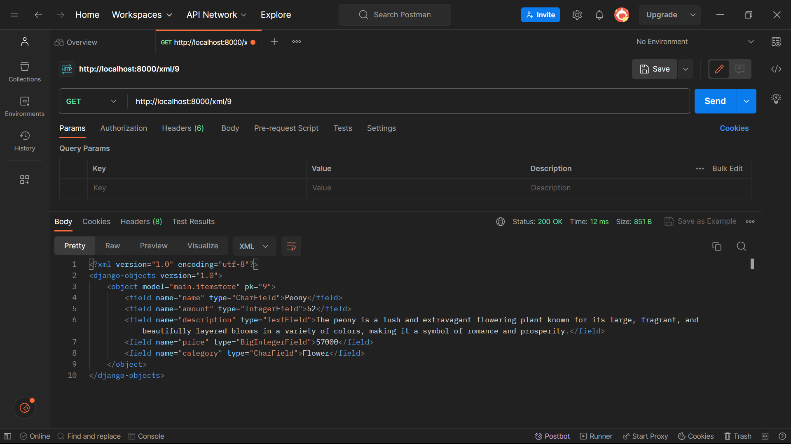
### JSON by ID (http://localhost:8000/json/[id])
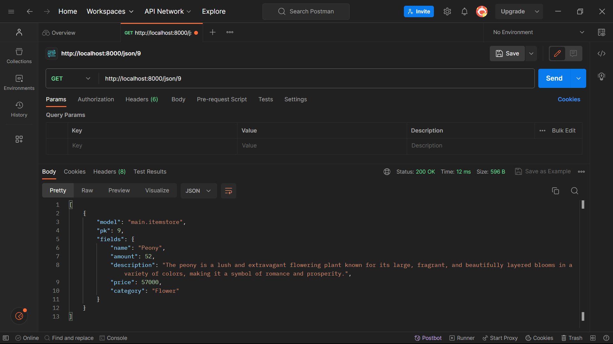

</details>
<br/>

# **Tugas 4: Implementasi Autentikasi, Session, dan Cookies pada Django**<br/>


<details open>
  <summary>Tugas 4</summary>

<br/>

## **Mengimplementasikan fungsi registrasi, login, dan logout untuk memungkinkan pengguna untuk mengakses aplikasi sebelumnya dengan lancar**

1. Buka command prompt pada direktori utama `item_insight`. Selanjutnya, aktifkan virtual environment dengan perintah berikut.
```
env\Scripts\activate.bat
```

2. Buka `views.py` yang terdapat dalam subdirektori `main` dan tambahkan beberapa import di bawah ini pada bagain paling atas kode. 
```
from django.shortcuts import redirect
from django.contrib.auth.forms import UserCreationForm
from django.contrib import messages 
```
Impor `UserCreationForm` berfungsi untuk memudahkan pembuatan formulir pendaftaran pengguna dalam aplikasi web sehingga pengguna baru dapat mendaftar dengan mudah di situs web  tanpa harus menulis kode dari awal.

3. Buatlah fungsi `register`, `login_user`, dan `logout_user` yang menerima parameter `request`. Tambahkan kode berikut ke dalam fungsi-fungsi tersebut.
```
def register(request):
    form = UserCreationForm()

    if request.method == "POST":
        form = UserCreationForm(request.POST)
        if form.is_valid():
            form.save()
            messages.success(request, 'Your account has been successfully created!')
            return redirect('main:login')
    context = {'form':form}
    return render(request, 'register.html', context)

def login_user(request):
    if request.method == 'POST':
        username = request.POST.get('username')
        password = request.POST.get('password')
        user = authenticate(request, username=username, password=password)
        if user is not None:
            login(request, user)
            response = HttpResponseRedirect(reverse("main:show_item")) 
            response.set_cookie('last_login', str(datetime.datetime.now()))
            return response
        else:
            messages.info(request, 'Sorry, incorrect username or password. Please try again.')
    context = {}
    return render(request, 'login.html', context)

def logout_user(request):
    logout(request)
    return redirect('main:login')
```

4. Pada folder `templates` yang terdapat dalam subdirektori `main`, buat file HTML baru dengan nama `register.html`. Isi file tersebut dengan kode berikut.
```



    <title>Register</title>


  

<div class = "login">
    
    <h1>Register</h1>  

        <form method="POST" >  
              
            <table>  
                {{ form.as_table }}  
                <tr>  
                    <td></td>
                    <td><input type="submit" name="submit" value="Daftar"/></td>  
                </tr>  
            </table>  
        </form>

      
        <ul>   
              
                <li>{{ message }}</li>  
                  
        </ul>   
    

</div>  


```

5. Pada folder `templates` yang terdapat dalam subdirektori `main`, buat file HTML baru dengan nama `login.html`. Isi file tersebut dengan kode berikut.
```



    <title>Login</title>




<div class = "login">

    <h1>Login</h1>

    <form method="POST" action="">
        
        <table>
            <tr>
                <td>Username: </td>
                <td><input type="text" name="username" placeholder="Username" class="form-control"></td>
            </tr>
                    
            <tr>
                <td>Password: </td>
                <td><input type="password" name="password" placeholder="Password" class="form-control"></td>
            </tr>

            <tr>
                <td></td>
                <td><input class="btn login_btn" type="submit" value="Login"></td>
            </tr>
        </table>
    </form>

    
        <ul>
            
                <li>{{ message }}</li>
            
        </ul>
         
        
    Don't have an account yet? <a href="">Register Now</a>

</div>


```


6. Tambahkan potongan kode di bawah ini setelah *hyperlink tag* untuk *Add New Product* pada berkas `main.html`
```
...
<a href="">
    <button>
        Logout
    </button>
</a>
...
```

6.  Tambahkan *path url* ke dalam `urlpatterns`  agar dapat mengakses fungsi register yang sebelumnya telah diimpor.
```
...
path('register/', register, name='register'), 
...
```

7. Buka file `urls.py` yang terdapat dalam direktori `main`. Selanjutnya, *import* fungsi register, login_user, dan logout_user. 
```
from main.views import register
from main.views import login_user
from main.views import logout_user
```

8. Tambahkan *path url* pada list `urlpatterns` untuk mengakses ketiga fungsi yang tadi telah di *import*.
```
urlpatterns = [
    ...
    path('register/', register, name='register'),
    path('login/', login_user, name='login'),
    path('logout/', logout_user, name='logout'),
]
```

7. Buka `views.py` yang terdapat dalam subdirektori `main` dan import `login_required` pada bagian paling atas agar mengharuskan pengguna masuk (login) untuk dapat mengakses suatu halaman web.
```
from django.contrib.auth.decorators import login_required
```

8. Modifikasi file `views.py` dengan menambahkan kode `@login_required(login_url='/login')` di atas fungsi show_item agar halaman main hanya dapat diakses oleh pengguna yang sudah login (terautentikasi).
```
...
@login_required(login_url='/login')
def show_item(request):
...
```

9. Jalankan proyek Django dengan perintah `python manage.py runserver` dan buka http://localhost:8000/ melalui peramban web untuk mengecek apakah program telah berhasil.

## **Membuat Dua Akun Pengguna dengan Masing-Masing Tiga Dummy Data Menggunakan Model yang Telah Dibuat Pada Aplikasi Sebelumnya untuk Setiap Akun di Lokal.**
Langkah-langkah:
1. Register akun pertama dengan memasukkan username dan password sesuai keinginan dengan ketentuan yang berlaku. Masukkan juga pasword konfirmasi agar proses registrasi berhasil.
2. Buatlah tiga dummy data pada akun pertama yang sebelumnya telah dibuat dengan memasukkan data pada form.
3. Logout dari akun pertama, kemudian registrasi kembali untuk membuat akun kedua.  Masukkan username dan password akun kedua sesuai keinginan dengan ketentuan yang berlaku. Pastikan bahwa username akun kedua berbeda dengan username akun pertama. Masukkan juga pasword konfirmasi agar proses registrasi akun kedua berhasil.
4. Buatlah tiga dummy data ke akun kedua yang tadi telah dibuat dengan memasukkan data pada form. Buatlah dummy data yang berbeda dari akun pertama agar perbedaannya dapat dibandingkan.

### Akun Pertama
username: shanti.yoga
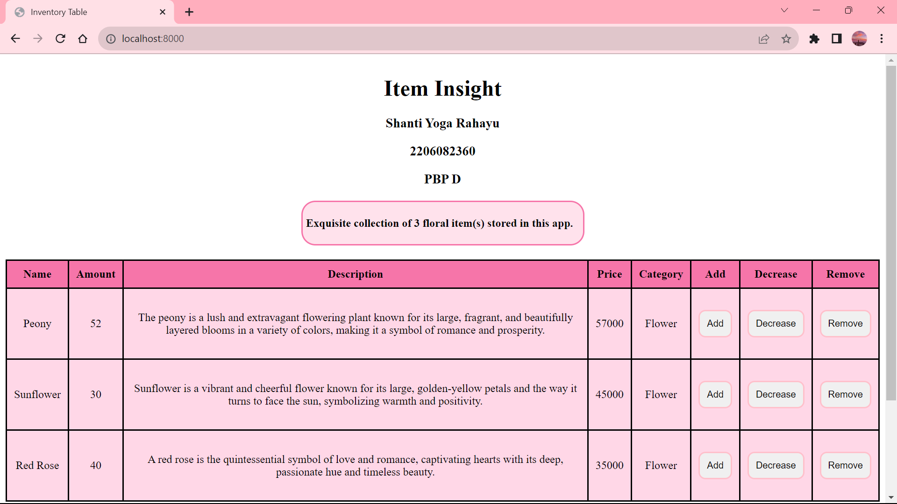
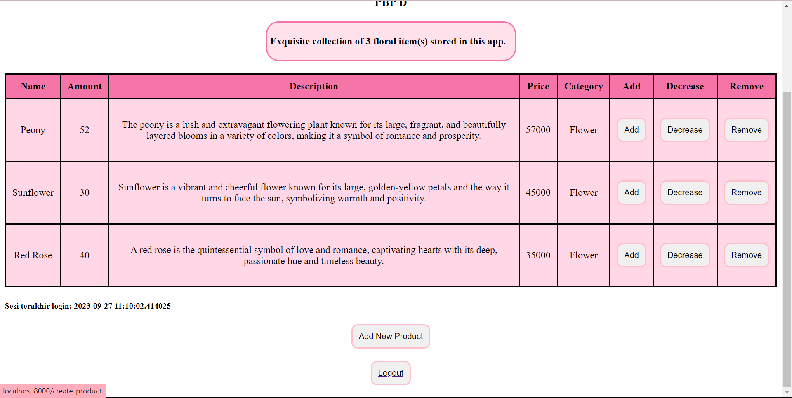

### Akun Kedua
username: shantirz
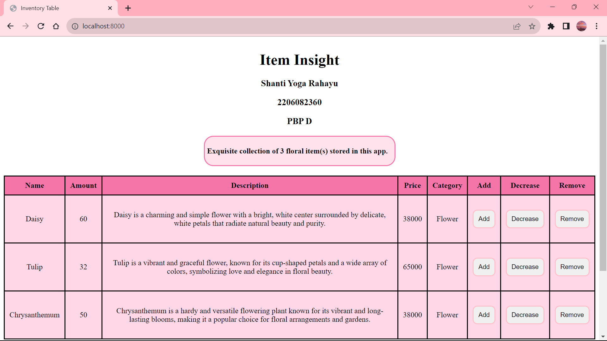
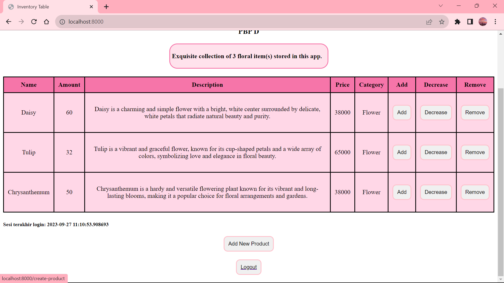

## **Menghubungkan Model ItemStore dengan User.**
1. Buka `models.py` yang terdapat pada subdirektori `main`, kemudian tambahkan *import* potongan kode berikut.
```
from django.contrib.auth.models import User
```

2. Pada model `ItemStore`, modifikasi dengan menambahkan potongan kode berikut.
```
class InventoryItem(models.Model):
    ...
    user = models.ForeignKey(User, on_delete=models.CASCADE)
```
3. Buka `views.py` yang terdapat dalam dubdirektori `main` dan modifikasi fungsi create_product sebagai berikut.
```
def create_product(request):
    form = ProductForm(request.POST or None)

    if form.is_valid() and request.method == "POST":
        product = form.save(commit=False)
        product.user = request.user
        product.save()
        return HttpResponseRedirect(reverse('main:show_item'))
    context = {'form': form}
    return render(request, "create_product.html", context)
```
4. Modifikasi fungsi `show_item` agar menjadi seperti potongan kode berikut.
```
def show_item(request):
    items = ItemStore.objects.filter(user=request.user)

    context = {
        'name': request.user.username,
        ...
    }
```
5. Simpan seluruh perubahan dan lakukan migrasi dengan perintah `python manage.py makemigrations`.

6. Ketika muncul error saat melakukan migrasi model, maka pilih 1 untuk menetapkan *default value* untuk *field user* pada semua *row* yang telah dibuat pada basis data.

7. Ketik angka 1 lagi untuk menetapkan user dengan ID 1 (yang sudah dibuat sebelumnya) pada model yang sudah ada.

8. Terapkan perubahan migrasi yang telah dibuat pada poin sebelumnya dengan menjalankan perintah `python manage.py migrate`.

9. Jalankan proyek Django dengan perintah `python manage.py runserver` dan buka http://localhost:8000/ melalui peramban web untuk mengecek apakah program telah berhasil.

## **Menampilkan Detail Informasi Pengguna yang Sedang *Logged In* seperti Username dan Menerapkan *Cookies* seperti *Last Login* pada Halaman Utama Aplikasi.**

1. Buka `views.py` yang terdapat dalam subdirektori `main`. Selanjutnya, tambahkan beberapa import berikut.
```
import datetime
from django.http import HttpResponseRedirect
from django.urls import reverse
```
2. Pada fungsi `login_user`` tepatnya pada blok `if user is not None`,` tambahkan potongan kode berikut untuk menambahkan cookie yang bernama `last_login` untuk melihat kapan terakhir kali pengguna melakukan login.
```
...
if user is not None:
    login(request, user)
    response = HttpResponseRedirect(reverse("main:show_item")) 
    response.set_cookie('last_login', str(datetime.datetime.now()))
    return response
...
```
3. Tambahkan potongan kode 'last_login': request.COOKIES['last_login'] ke dalam variabel context pada fungsi `show_item` sebagai berikut.
```
context = {
        'name': request.user.username,
        'creator' : 'Shanti Yoga Rahayu',
        'id' : 2206082360,
        'class' : 'PBP D',
        'items_list': items,
        'last_login': request.COOKIES['last_login'],
    }
```
`'last_login': request.COOKIES['last_login']` berfungsi unruk menambahkan informasi cookie `last_login` pada response yang akan ditampilkan di halaman web.

4. Modifikasi fungsi `logout_user` pada file `views.py` yang tedapat dalam subdirektori main menjadi potongan kode sebagai berikut.
```
def logout_user(request):
    logout(request)
    response = HttpResponseRedirect(reverse('main:login'))
    response.delete_cookie('last_login')
    return response
```
5. Buka berkas `main.html`, kemudian modifikasi file tersebut dengan menambahkan potongan kode berikut di antara tabel dan tombol logout untuk menampilkan data last login.
```
...
<h5>Sesi terakhir login: {{ last_login }}</h5>
...
```

6. Jalankan proyek Django dengan perintah `python manage.py runserver` dan buka http://localhost:8000/ melalui peramban web untuk mengecek apakah program telah berhasil dan data *last login* muncul pada halaman main.

7. Untuk mengecek *data cookie last_login*, gunakan fitur *inspect element* dan buka bagian Application atau Storage. Selanjutnya, klik opsi Cookies untuk melihat seluruh *data cookies* yang tersedia. Selain last_login, dapat terlihat juga data lain seperti `sessionid` dan `csrftoken`. Berikut ini adalah contoh tampilannya.

8.  Apabila *user* melakukan logout dan membuka bagian riwayat cookie, maka cookie yang dibuat sebelumnya akan hilang. Cookie tersebut akan dibuat ulang ketika *user* login kembali.

## **Bonus: Menambahkan Tombol dan Fungsi untuk Menambahkan `amount` Suatu Objek Sebanyak Satu, Mengurangi Jumlah Stok Suatu Objek Sebanyak Satu, dan Menghapus Suatu Objek dari Inventori.**

### Tambahkan tombol dan fungsi untuk menambahkan dan mengurangi `amount` suatu objek sebanyak satu dan tombol untuk mengurangi jumlah stok suatu objek sebanyak satu dengan langkah-langkah berikut.
1. Buka file `views.py` yang terdapat dalam subdirektori `main`, kemudian modifikasi file tersebut dengan menambahkan fungsi increment untuk menambahkan  `amount` suatu objek sebanyak satu dan fungsi decrement untuk mengurangi  `amount` suatu objek sebanyak satu. Isi fungsi tersebut dengan potongan kode berikut.

```
def increment(request, item_id):
    if request.method == 'POST' and 'Increment' in request.POST:
        item = ItemStore.objects.get(id=item_id)

        if item.amount > 0:
            item.amount += 1
            item.save()
    return HttpResponseRedirect(reverse('main:show_item'))

def decrement(request, item_id):
    if request.method == 'POST' and 'Decrement' in request.POST:
        item = ItemStore.objects.get(id=item_id)
        
        if item.amount < 1:
            item.delete()
        else:
            item.amount -= 1
            item.save()
    return HttpResponseRedirect(reverse('main:show_item'))
```
2. Buka `urls.py` yang terdapat dalam subdirektori `main` dan tambahkan import untuk fungsi increment dan decrement yang sebelumnya telah dibuat. Selanjutnya, tambahkan juga path url di dalam urlpatterns untuk mengakses kedua fungsi tersebut. 
```
from main.views import increment
from main.views import decrement

app_name = 'main'

urlpatterns = [
    ...
    path('add_items/<int:item_id>/', add_items, name='add_items'),
    path('dec_items/<int:item_id>/', dec_items, name='dec_items'),
]
```

3. Buka file `main.html` dan tambahkan potongan kode berikut ini.
```
...
    <td>
        <form action="" method="post">
            
            <button type="submit" name="Increment">Add</button>
        </form>
    </td>
    <td>
        <form action="" method="post">
            
            <button type="submit" name="Decrement">Decrease</button>
        </form>
    </td>
    <td>
...
```
4. Tambahkan juga *table header* untuk menyesuaikan isi table data.

### Tambahkan tombol dan fungsi untuk menghapus suatu objek dari inventori dengan langkah-langkah berikut.
1. Buka file `views.py` yang terdapat dalam subdirektori `main`, kemudian modifikasi file tersebut dengan menambahkan fungsi remove menghapus suatu objek dari inventori. Isi fungsi tersebut dengan potongan kode berikut.
```
def remove(request, item_id):
    if request.method == 'POST' and 'Remove' in request.POST:
        item = ItemStore.objects.get(id=item_id)
        item.delete()
    return HttpResponseRedirect(reverse('main:show_item'))
```
2. Buka `urls.py` yang terdapat dalam subdirektori `main` dan tambahkan import untuk fungsi increment dan decrement yang sebelumnya telah dibuat. Selanjutnya, tambahkan juga path url di dalam urlpatterns untuk mengakses kedua fungsi tersebut. 
```
from django.urls import path
from main.views import remove
urlpatterns = [
    ...  
    path('remove/<int:item_id>/', remove, name='remove'),
]
```
3. Buka file `main.html`` dan tambahkan potongan kode berikut.
```
...
<td>
    <form action="" method="post">
        
        <button type="submit" name="Remove">Remove</button>
    </form>
</td>  
...
```
4. Tambahkan juga *table header* untuk menyesuaikan isi table data.


## **Apa itu Django `UserCreationForm`, dan jelaskan apa kelebihan dan kekurangannya?**
Django `UserCreationForm` adalah formulir yang disediakan oleh framework otentikasi Django untuk menangani pembuatan pengguna baru yang dapat menggunakan aplikasi web.Formulir ini merupakan turunan dari kelas `ModelForm`. Formulir ini biasa digunakan pada halaman registrasi. `UserCreationForm` menyediakan field-field yang biasanya diperlukan untuk membuat akun pengguna, seperti nama pengguna (username), kata sandi (password), dan konfirmasi kata sandi (password confirmation).

### Kelebihan dari `UserCreationForm`, antara lain:
#### 1. Mudah Digunakan 
Django `UserCreationForm` sudah disediakan oleh Django, sehingga pengembang tidak perlu menulis kode dari nol untuk membuat formulir pembuatan pengguna dan menghemat waktu pengembangan.

#### 2. Validasi Otomatis
Django `UserCreationForm` dapat melakukan validasi otomatis untuk memastikan bahwa input yang dimasukkan oleh pengguna sesuai dengan aturan yang ditetapkan, seperti memeriksa apakah kata sandi sudah cukup kuat atau tidak.

#### 3. Mudah Dikustomisasi
Django `UserCreationForm` dapat disesuaikan dengan kebutuhan aplikasi web yang ingin dibuat.

#### 4. Integrasi Model User
Django `UserCreationForm` bekerja dengan model User yang disediakan oleh Django sehingga pengguna yang terdaftar akan secara otomatis ditambahkan ke basis data aplikasi.

### Kekurangan dari `UserCreationForm`, antara lain:
#### 1. Keterbatasan Fungsionalitas 
Django `UserCreationForm` menyediakan fungsi dasar untuk pendaftaran pengguna. Jika pengembang memerlukan fungsionalitas yang lebih kompleks, maka perlu menulis kode tambahan.

#### 2. Tampilan Default
Django `UserCreationForm` hanya menyediakan formulir dalam bentuk HTML mentah sehingga jika ingin merancang tampilan pendaftaran yang lebih menarik atau kompleks, pengembang harus merancang sendiri atau menggunakan *alat* *front-end* tambahan.

#### 3. Ketergantungan pada Model User Bawaan
Jika menggunakan model User kustom atau sistem autentikasi yang berbeda, pengembang mungkin akan menemukan beberapa masalah kompatibilitas.

#### 4. Tidak Memberikan Fitur Keamanan Tingkat Lanjut Secara Otomatis
Meskipun UserCreationForm menyediakan validasi dasar, seperti memeriksa kekuatan kata sandi, formulir ini tidak otomatis mengimplementasikan fitur-fitur keamanan tingkat lanjut, sehingga perlu mengimplementasikan fitur-fitur ini secara terpisah.

## **Apa Perbedaan antara Autentikasi dan Otorisasi dalam Konteks Django, dan Mengapa Keduanya Penting?**

### Autentikasi
Autentikasi adalah proses verifikasi identitas pengguna dengan memastikan bahwa pengguna adalah orang yang diizinkan. Tujuan dari autentikasi adalah untuk mencegah akses yang tidak sah atau tidak diizinkan ke dalam sistem. Django menyediakan sistem autentikasi yang memungkinkan pengguna untuk mendaftar, login, dan logout yang melibatkan verifikasi bahwa pengguna memiliki kredensial yang benar, seperti username dan password. Contoh penggunaan autentikasi dalam Django adalah menggunakan `@login_required` dekorator untuk memastikan bahwa hanya pengguna yang telah terautentikasi yang dapat mengakses suatu view.

### Otorisasi
Otorisasi adalah proses menentukan apa yang diizinkan atau dilarang untuk dilakukan oleh pengguna yang sudah ter-autentikasi dalam aplikasi. Otorisasi menentukan akses ke sumber daya dan fungsi tertentu berdasarkan peran atau hak akses pengguna. Tujuan dari otorisasi adalah untuk mencegah akses yang tidak sah atau tidak diinginkan ke data atau fungsi penting. Contoh penggunaan otorisasi dalam Django adalah menggunakan `@permission_required` atau `@user_passes_test` untuk membatasi akses pengguna berdasarkan izin atau kondisi tertentu.

### Alasan Mengapa Keduanya Penting
#### 1. Pencegahan Serangan Keamanan
Autentikasi membantu mencegah serangan seperti serangan perusakan otentikasi (brute force) dan serangan phishing yang dapat membahayakan akun pengguna. Sementara itu, otorisasi mencegah serangan yang bertujuan untuk mendapatkan akses tidak sah ke bagian-bagian kritis dari aplikasi.

#### 2. Pencegahan Pelanggaran Privasi
Autentikasi dan otorisasi membantu menghindari pelanggaran privasi dengan membatasi akses ke data pribadi dan sensitif hanya kepada orang yang berhak.

#### 3. Kontrol terhadap Tindakan Pengguna
Autentikasi memungkinkan aplikasi untuk mengidentifikasi pengguna untuk melacak aktivitas pengguna dan memberikan pengalaman yang personal. Sementara itu, otorisasi memungkinkan pengembang untuk mengendalikan apa yang dapat dilakukan oleh pengguna dalam aplikasi berdasarkan peran atau izin yang dimiliki. Misalnya, administrator memiliki hak akses yang berbeda dari pengguna biasa.

#### 4. Kepatuhan Hukum atau Regulasi
Banyak standar hukum keamanan dan regulasi sektor industri mengharuskan kontrol autentikasi dan otorisasi yang kuat untuk melindungi data pengguna. Autentikasi dan otorisasi membantu mematuhi persyaratan ini dengan memastikan hanya pengguna yang memiliki izin yang tepat yang dapat mengakses data sensitif.

## **Apa itu Cookies dalam Konteks Aplikasi Web, dan Bagaimana Django Menggunakan Cookies untuk Mengelola Data Sesi Pengguna?**
Cookies dalam konteks aplikasi web adalah potongan kecil data yang disimpan di *web browser* pengguna saat mereka mengunjungi situs web. Cookies digunakan oleh server web untuk menyimpan informasi yang dapat diakses kembali saat pengguna kembali ke situs. Informasi ini biasanya digunakan untuk mengidentifikasi pengguna, menyimpan preferensi, atau melacak perilaku pengguna.

Django menyediakan mekanisme bawaan untuk mengelola data sesi pengguna dengan menggunakan cookies. Berikut adalah cara Django menggunakan cookies untuk mengelola data sesi pengguna:

#### 1. Inisiasi Sesi Cookies
Saat pengunjung pertama kali mengakses situs web Django, server akan membuat sebuah cookie sesi dan mengirimkannya ke peramban web pengguna. Cookie ini berisi sebuah ID sesi yang bersifat unik, yang akan digunakan untuk mengidentifikasi sesi pengguna.

#### 2. Penyimpanan Data Berdasarkan ID Sesi
Informasi mengenai sesi pengguna tidak disimpan di dalam cookie itu sendiri, melainkan disimpan di server. Data tersebut mungkin mencakup informasi seperti status login, preferensi pengguna, dan lain-lain.

#### 3. Manajemen Data Berdasarkan ID Sesi
Saat pengguna mengirimkan permintaan ke situs yang memanfaatkan mekanisme sesi, Django akan menggunakan ID sesi yang terdapat dalam cookie untuk mengakses data sesi yang disimpan di server. Melalui proses ini, server dapat menyediakan data yang sesuai dengan kebutuhan aplikasi dan pengguna.

#### 4. Pembaruan Data Sesuai Permintaan
Selama interaksi pengguna di situs, data sesi dapat diperbarui atau ditambahkan sesuai kebutuhan. Django menyediakan API yang mempermudah proses penyimpanan dan pengambilan data sesi ini.

#### 5. Penutupan Sesi Berdasarkan Permintaan
Ketika sesi pengguna berakhir, contohnya karena pengguna logout atau sesi mencapai waktu kadaluwarsa, informasi sesi akan dihapus dari penyimpanan di server. Cookie sesi di peramban pengguna juga bisa dihapus untuk mengakhiri sesi sepenuhnya.


## **Apakah Penggunaan Cookies Aman secara Default dalam Pengembangan Web, atau Apakah Ada Risiko Potensial yang Harus Diwaspadai?**

Dalam pengembangan web, penggunaan cookies secara umum dapat dianggap aman jika dikelola dengan benar. Namun, penting untuk memahami risiko-risiko tertentu, seperti:

#### 1. Cookie Hijacking
Risiko ini muncul jika komunikasi antara peramban pengguna dan server tidak dienkripsi dengan benar menggunakan protokol HTTPS. Penyerang yang berada di tengah-tengah komunikasi dapat mencuri cookies atau mengganti data yang dikirim antara klien dan server.

#### 2. Cross-Site Scripting (XSS)
Ancaman ini muncul ketika situs web rentan terhadap serangan XSS. Dalam situasi ini, penyerang dapat menyisipkan skrip berbahaya ke dalam halaman web, yang kemudian dieksekusi oleh peramban pengguna sehingga berpotensi memungkinkan pencurian cookies dan serangan lainnya.

#### 3. Third-Party Cookies
Cookies dari pihak ketiga yang disematkan dalam situs web dapat digunakan untuk melacak perilaku pengguna di berbagai situs web. Ini bisa mengancam privasi pengguna dan memunculkan masalah privasi yang signifikan.

#### 4. Cross-Site Request Forgery (CSRF)
Dalam serangan CSRF, penyerang mencoba membuat pengguna yang telah terotentikasi melakukan tindakan tertentu di situs web tanpa sepengetahuan mereka. Hal ini dapat mengakibatkan tindakan yang tidak diinginkan, seperti mengganti kata sandi atau melakukan tindakan keuangan.

</details>
<br/>

# **Tugas 5: Desain Web menggunakan HTML, CSS dan Framework CSS**<br/>


<details open>
  <summary>Tugas 5</summary>

<br/>

## **Kustomisasi desain pada template HTML yang telah dibuat pada Tugas 4**
### 1. Kustomisasi halaman login. 
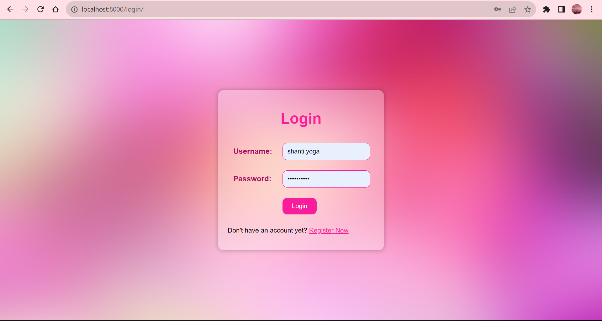
Berikut ini adalah penjelasan kustomisasi halaman login.

1. **Tambahkan `<style>` CSS**<br/>
Tambahkan elemen `<style>` di dalam blok konten untuk mengatur tampilan halaman login agar memungkinkan style CSS langsung dalam template HTML.
```
...



    <title>Login</title>



<style>
    ...
<style>
```

2. **Ubah Latar Belakang**<br/>
Atur latar belakang halaman login dengan properti `background-image` dengan menggunakan gambar yang diambil dari suatu URL. Gunakan `background-size: cover;` agar mengisi seluruh halaman.

```
    ...
    body {
        font-family: 'Poppins', sans-serif;
        background-image: url(https://getwallpapers.com/wallpaper/full/e/a/9/1227331-pink-laptop-wallpapers-1920x1080-for-desktop.jpg);
        background-size: cover; 
        display: flex;
        justify-content: center;
        align-items: center;
        height: 100vh;
        margin: 0;
    }
    ...
```

3. **Ganti Warna Latar Login Box**<br/>
Atur latar belakang dari elemen dengan kelas "login" menggunakan properti `background-color` dan berikan efek transparansi.
```
    ...
    .login {
        background-color: rgba(255, 255, 255, 0.3); 
        padding: 20px;
        border-radius: 10px;
        box-shadow: 0px 0px 10px rgba(0, 0, 0, 0.3);
    }
    ...
```

4. **Atur Style Tampilan Login**<br/>
Atur properti CSS untuk elemen-elemen di dalam halaman login, seperti `color`, `text-align`, `padding`, `border`, `border-radius`, `font-family`, dan lain-lain. Hal ini dilakukan untuk membuat tampilan elemen lebih menarik.
```
...

    h1 {
        color: #F91C9B;
        text-align: center;
    }

    table {
        margin: 0 auto;
    }

    td {
        padding: 10px;
    }

    td.label {
        color: #a90c65;
        font-weight: bold;
    }

    input[type="text"],
    input[type="password"] {
        width: 90%;
        padding: 10px;
        border: 1px solid #F91C9B; 
        border-radius: 10px;
        font-family: 'Poppins', sans-serif; 
        color: #88094f;
    }

    ul {
        list-style: none;
        padding: 0;
    }

    li {
        color: #78194f; 
        font-size: 12px;
    }

    a {
        color: #F91C9B; 
        font-family: 'Poppins', sans-serif;
    }
</style>

...
```

5. **Atur Style Tombol Login** <br/>
Ganti tampilan tombol login dalam `<style>` dengan mengatur beberapa properti seperti warna latar belakang, warna teks, padding, border, border-radius, cursor, dan font-family. Efek hover juga ditambahkan untuk mengganti warna latar belakang tombol saat mouse mengarah ke tombol tersebut.
```
...
    .login_btn {
        background-color: #F91C9B; 
        color: #fff;
        padding: 10px 20px;
        border: none;
        border-radius: 10px;
        cursor: pointer;
        font-family: 'Poppins', sans-serif; 
    }

    .login_btn:hover {
        background-color: #c7107e; 
    }
...
```

6. **Sesuaikan HTML dengan CSS**<br/>
Sesuaikan kode HTML dan pastikan bahwa atribut dan class pada elemen-elemen HTML cocok dengan CSS yang ditambahkan.
```
...
<div class="login">

    <h1>Login</h1>

    <form method="POST" action="">
        
        <table>
            <tr>
                <td class="label">Username: </td>
                <td><input type="text" name="username" placeholder="Username" class="form-control"></td>
            </tr>

            <tr>
                <td class="label">Password: </td>
                <td><input type="password" name="password" placeholder="Password" class="form-control"></td>
            </tr>

            <tr>
                <td></td>
                <td><input class="btn login_btn" type="submit" value="Login"></td>
            </tr>
        </table>
    </form>

    
        <ul>
            
                <li>{{ message }}</li>
            
        </ul>
    
        
    <p style="font-size: 14px;">Don't have an account yet? <a href="">Register Now</a></p>
</div>


```

7. **Validasi dan Uji**<br/>
Setelah berhasil mengubah kode, pastikan untuk menguji halaman web untuk memastikan tampilan telah sesuai.

### 2. Kustomisasi halaman register
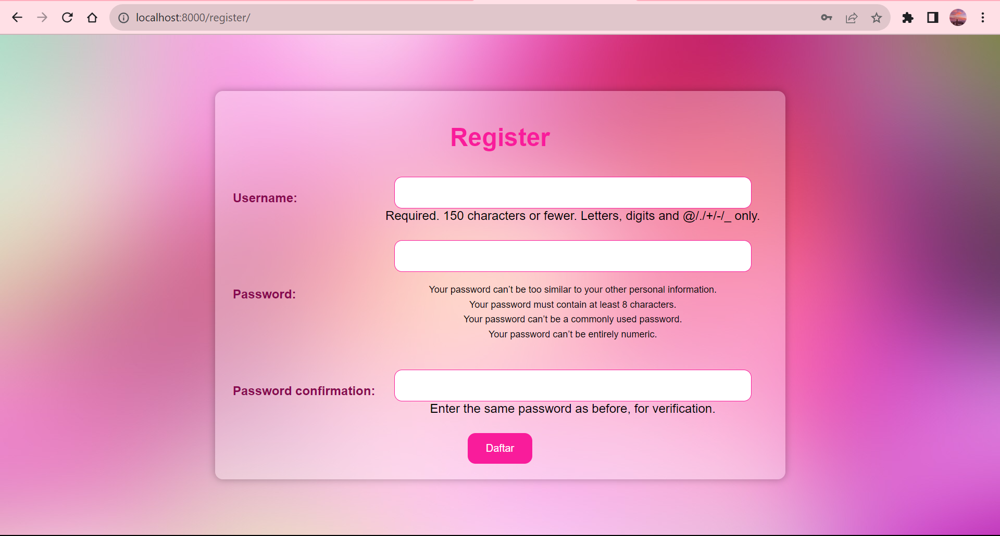

Berikut ini adalah penjelasan kustomisasi halaman register.

1. **Tambahkan CSS**<br/>
Tambahkan `<style>` CSS ke dalam template untuk mengatur tampilan berbagai elemen, termasuk latar belakang, tampilan form, warna teks, dan lainnya.
```



    <title>Register</title>


  
<style>
...
</style>
```

2. **Ubah Latar Belakang**<br/>
Atur latar belakang halaman register dengan properti `background-image` dengan menggunakan gambar yang diambil dari suatu URL. Gunakan `background-size: cover;` agar mengisi seluruh halaman.
```
...
<style>
    body {
        font-family: 'Poppins', sans-serif;
        background-image: url(https://getwallpapers.com/wallpaper/full/e/a/9/1227331-pink-laptop-wallpapers-1920x1080-for-desktop.jpg);
        background-size: cover; 
        display: flex;
        justify-content: center;
        align-items: center;
        height: 100vh;
        margin: 0;
    }
...
```
3. **Ganti Warna Latar Login Box**<br/>
Di dalam `<style>` `</style>` atur latar belakang dari elemen dengan kelas "login" menggunakan properti `background-color` dan berikan efek transparansi.
```
    ...
    .register {
        background-color: rgba(255, 255, 255, 0.3); 
        padding: 20px;
        border-radius: 10px;
        box-shadow: 0px 0px 10px rgba(0, 0, 0, 0.3);
        text-align: center;
        margin: 0;
    }
    ...
```

4. **Ubah Style sesuai Keinginan**<br/>
Gantilah tampilan yang ingin diterapkan pada halaman register. Atur properti CSS untuk elemen-elemen di dalam register, seperti `color`, `text-align`, `padding`, `border`, `border-radius`, `font-family`, dan lain-lain untuk membuat tampilan lebih menarik.
```



    <title>Register</title>


  
<style>
    body {
        font-family: 'Poppins', sans-serif;
        background-image: url(https://getwallpapers.com/wallpaper/full/e/a/9/1227331-pink-laptop-wallpapers-1920x1080-for-desktop.jpg);
        background-size: cover; 
        display: flex;
        justify-content: center;
        align-items: center;
        height: 100vh;
        margin: 0;
    }

    .register {
        background-color: rgba(255, 255, 255, 0.3); 
        padding: 20px;
        border-radius: 10px;
        box-shadow: 0px 0px 10px rgba(0, 0, 0, 0.3);
        text-align: center;
        margin: 0;
    }

    h1 {
        color: #F91C9B; 
        margin-bottom: 20px; 
    }

    table {
        margin: 0 auto;
    }

    td {
        padding: 10px;
    }

    label {
        color: #88094f;
        text-align: left; 
        display: block; 
        margin-bottom: 5px;
    }

    input[type="text"],
    input[type="password"] {
        width: 90%; 
        padding: 12px;
        border: 1px solid #F91C9B;
        border-radius: 10px;
        font-family: 'Poppins', sans-serif;
        color:  #88094f
    }


    input[type="submit"] {
        width: 12%; 
        padding: 12px; 
        background-color: #F91C9B;
        color: #fff;
        border: none;
        border-radius: 10px;
        cursor: pointer;
        font-family: 'Poppins', sans-serif; 
        margin: 0 auto; 
        display: block;
        margin-top: 10px;
    }

    input[type="submit"]:hover {
        background-color: #c7107e;
    }

    ul {
        list-style: none;
        padding: 0;
    }

    li {
        color: #000000; 
        font-size: 12px; 
        margin-top: 5px; 
    }

    .pink-text {
        color:  #88094f; 
    }
</style>
```

5. **Sesuaikan HTML dengan CSS** <br/>
Sesuaikan kode HTML dan pastikan bahwa atribut dan class pada elemen-elemen HTML cocok dengan CSS yang ditambahkan.
```
...
<div class="register">
    
    <h1>Register</h1>  

    <form method="POST">  
          
        <table>  
            {{ form.as_table }}  
        </table>
        <input type="submit" name="submit" value="Daftar"/> 
    </form>

      
        <ul>   
              
                <li><span class="pink-text">{{ message }}</span></li>  
              
        </ul>   
    

</div>  
  
```

6. **Validasi dan Uji**<br/>
Setelah berhasil mengubah kode, pastikan untuk menguji halaman web untuk memastikan tampilan telah sesuai.

### 3. Kustomisasi Tambah Inventori
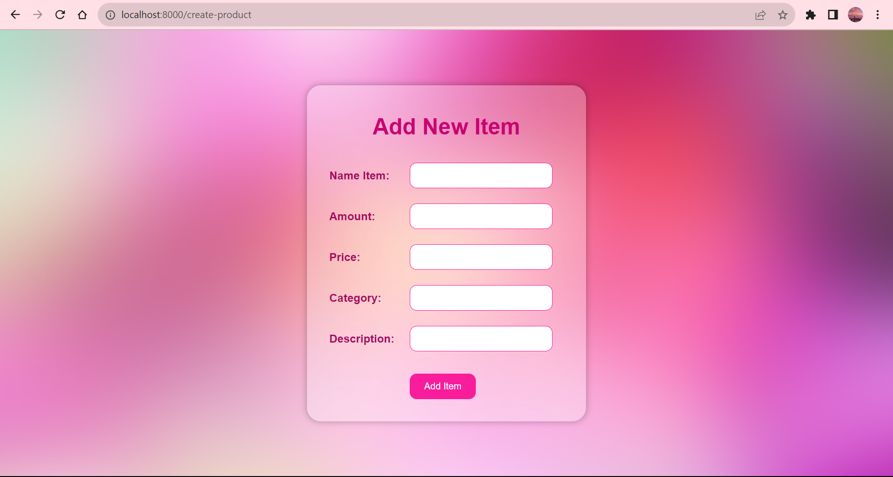

Berikut ini adalah penjelasan kustomisasi tambah inventori.

1. **Tambahkan CSS**<br/>
Tambahkan CSS ke dalam template untuk mengatur tampilan berbagai elemen, termasuk latar belakang, tampilan form, warna teks, dan lainnya.
```



<style>
...
</style>

...
```

2. **Ubah Latar Belakang**<br/>
Atur latar belakang halaman login dengan properti `background-image` dengan menggunakan gambar yang diambil dari suatu URL. Gunakan `background-size: cover;` agar mengisi seluruh halaman.
```
...
<style>
    body {
        font-family: 'Poppins', sans-serif;
        background-image: url(https://getwallpapers.com/wallpaper/full/e/a/9/1227331-pink-laptop-wallpapers-1920x1080-for-desktop.jpg);
        background-size: cover;
        display: flex;
        justify-content: center;
        align-items: center;
        height: 100vh;
        margin: 0;
    }
...
```

3. **Ubah Style sesuai Keinginan**<br/>
Tambahkan sejumlah CSS styling yang akan memengaruhi tampilan halaman, seperti mengubah font, mengatur latar belakang, merubah warna teks, membuat input field, merupah style tombol, dan lain-lain agar tampilan halaman menjadi lebih menarik dan terstruktur.
```
...
<style>
    body {
        font-family: 'Poppins', sans-serif;
        background-image: url(https://getwallpapers.com/wallpaper/full/e/a/9/1227331-pink-laptop-wallpapers-1920x1080-for-desktop.jpg);
        background-size: cover;
        display: flex;
        justify-content: center;
        align-items: center;
        height: 100vh;
        margin: 0;
    }

    .create_product {
        width: 360px;
        background-color: rgba(255, 255, 255, 0.3);
        padding: 20px;
        border-radius: 20px;
        box-shadow: 0px 0px 10px rgba(0, 0, 0, 0.3);
    }

    h1 {
        color: #cb0073;
        text-align: center;
    }

    td {
        padding: 10px;
    }

    td.label {
        color: #a90c65;
        font-weight: bold;
    }

    input[type="text"],
    input[type="submit"] {
        width: 100%;
        padding: 10px;
        border: 1px solid #F91C9B;
        border-radius: 10px;
        font-family: 'Poppins', sans-serif;
        color: #88094f;
    }

    input[type="submit"] {
        background-color: #F91C9B;
        color: #fff;
        cursor: pointer;
        width: auto; 
        padding: 10px 20px; 
    }

    input[type="submit"]:hover {
        background-color: #c7107e;
    }
 
    .button-container {
        align-items: center;
        margin: 0 auto; 
        display: block; 
        margin-top: 10px;
    }
</style>
...
```

4. **Tambahkan Validasi Input Numerik dengan JavaScript**<br/>
Tambahkan skrip JavaScript untuk memvalidasi input numerik pada "Amount" dan "Price" untuk memastikan bahwa nilai yang dimasukkan adalah numerik.
```
...

    .error-message {
        color: rgb(149, 6, 80);
        font-size: 12px;
        display: none;
        margin-top: 5px; 
    }
...
```

6. **Sesuaikan HTML dengan CSS** <br/>
Sesuaikan kode HTML dan pastikan bahwa atribut dan class pada elemen-elemen HTML cocok dengan CSS yang ditambahkan.
```
...

</script>

<div class="create_product">

    <h1>Add New Item</h1>

    <form method="POST">
        
        <table>
            <tr>
                <td class="label">Name Item: </td>
                <td><input type="text" name="name" class="form-control"></td>
            </tr>
            <tr>
                <td class="label">Amount: </td>
                <td>
                    <input type="text" name="amount" class="amount" onblur="validateNumericInput(this, 'amountError')">
                    <p id="amountError" class="error-message">Amount must be a numeric value.</p>
                </td>
            </tr>
            <tr>
                <td class="label">Price: </td>
                <td>
                    <input type="text" name="price" class="price" onblur="validateNumericInput(this, 'priceError')">
                    <p id="priceError" class="error-message">Price must be a numeric value.</p>
                </td>
            </tr>
            <tr>
                <td class="label">Category: </td>
                <td><input type="text" name="category" class="form-control"></td>
            </tr>
            <tr>
                <td class="label">Description: </td>
                <td><input type="text" name="description" class="form-control"></td>
            </tr>
            <tr>
                <td></td>
                <td class="button-container">
                    <input class="btn createproduct_button" type="submit" value="Add Item">
                </td>
            </tr>
        </table>
    </form>

</div>

```

7. **Validasi dan Uji**<br/>
Setelah berhasil mengubah kode, pastikan untuk menguji halaman web untuk memastikan tampilan telah sesuai.

### 4. Kustomisasi Halaman Daftar Inventori Menjadi Lebih Berwarna
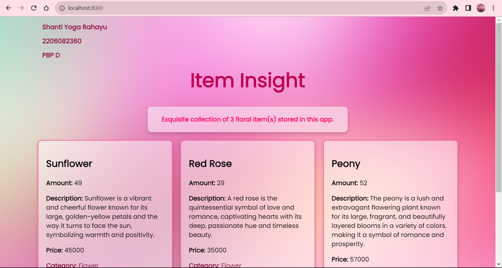
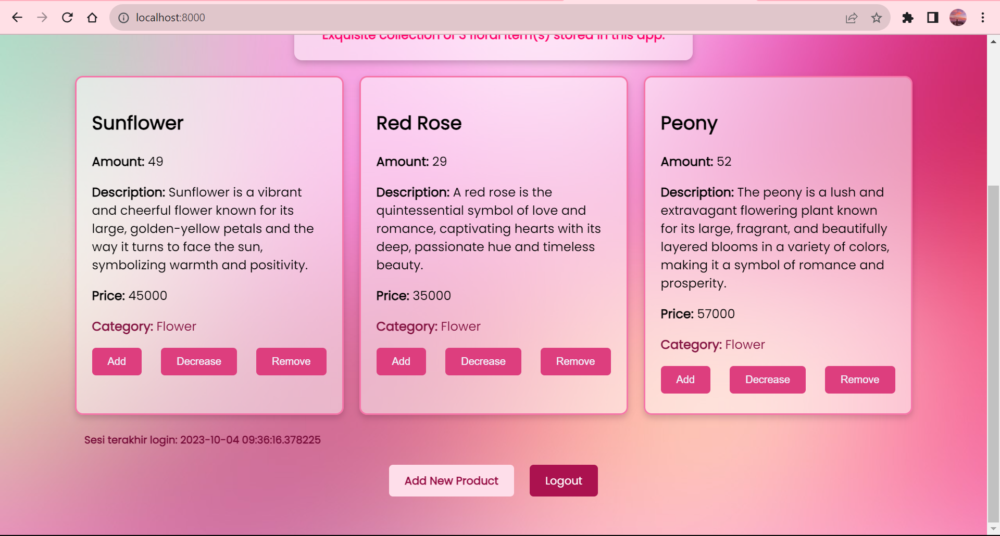


Berikut ini adalah penjelasan kustomisasi halaman daftar inventori.

1. **Tambahkan CSS**<br/>
Tambahkan `<style>` CSS ke dalam template untuk mengatur tampilan berbagai elemen, termasuk latar belakang, tampilan form, warna teks, dan lainnya.
```



<!DOCTYPE html>
<html lang="en">
<head>
    <head>
        <link rel="stylesheet" href="https://fonts.googleapis.com/css?family=Poppins&display=swap">
        <meta charset="UTF-8">
        <meta name="viewport" content="width=device-width, initial-scale=1.0">
        <title>Inventory Cards</title>
     
    <style>

...
    </style>
```

2. **Ubah Latar Belakang**<br/>
Atur latar belakang halaman login dengan properti `background-image` dengan menggunakan gambar yang diambil dari suatu URL. Gunakan `background-size: cover;` agar mengisi seluruh halaman.
```
...
        body {
            background-image: url(https://getwallpapers.com/wallpaper/full/e/a/9/1227331-pink-laptop-wallpapers-1920x1080-for-desktop.jpg);
            background-repeat: no-repeat;
            background-attachment: fixed;
            font-family: 'Poppins', sans-serif;
        }
...
```

3. **Ubah Style Teks Judul, Nama, NPM, Kelas**<br/>
Ganti warna teks, posisi, dan ukuran teks warna sesuai preferensi.
```
...
        .data-app {
            font-family: 'Poppins', sans-serif;
            font-size: 14px;
            line-height: 1.2; 
            color: #8a093c; 
            margin-left: 100px;
        }
...
```

4. **Ganti Tampilan Data**<br/>
Ubah tampilan data dari tabel mejadi card. Ganti markup HTML dan CSS untuk membuat kartu yang sesuai dengan data. Sesuaikan ukuran elemen-elemen, margin, dan padding sesuai kebutuhan dan keinginan dengan mengedit properti CSS yang relevan.
```
...
    <st>
        body {
            background-image: url(https://getwallpapers.com/wallpaper/full/e/a/9/1227331-pink-laptop-wallpapers-1920x1080-for-desktop.jpg);
            background-repeat: no-repeat;
            background-attachment: fixed;
            font-family: 'Poppins', sans-serif; 
        }

        .title-container {
            text-align: center; 
            margin: auto; 
            margin-bottom : 30px;
        }

        .item-insight-title {
            font-family: 'Poppins', sans-serif; 
            font-size: 50px; 
            font-weight: bold;
            color: #bd014f; 
            margin: 0; 
}
        
        .data-app {
            font-family: 'Poppins', sans-serif;
            font-size: 14px;
            line-height: 1.2; 
            color: #8a093c;
            margin-left: 100px;
        }
    
        h3, p, h2 {
            font-family: 'Poppins', sans-serif;
        }

        .item-count-container {
        width: 500px;
        text-align: center;
        background-color: rgba(255, 255, 255, 0.5);
        padding: 5px 5px;
        margin: auto;
        justify-content: center;
        border-radius: 10px; 
        box-shadow: 0 4px 8px rgba(0, 0, 0, 0.2);
    }

        .item-count {
            font-weight: bold;
            font-size: 16px; 
            color: #ff0066; 
        }
    
        .item-cards {
            margin-top: 20px;
            display: flex;
            flex-wrap: wrap;
            gap: 20px;
            justify-content: center;
        }
    
        .item-card {
            width: 300px;
            padding: 20px;
            padding-bottom: 25px;
            border: 2px solid #f675a9;
            border-radius: 10px;
            background-color: rgba(255, 255, 255, 0.5);
            box-shadow: 0 4px 8px rgba(46, 6, 26, 0.2);
            transition: transform 0.2s;
        }

        .item-category {
            color: #831341; 
        }

        .item-category-value {
             color: #831341; 
        }

        .item-card:hover {
            transform: scale(1.05);
        }
    
        .item-details {
            text-align: left;
            margin-top: 10px;
        }
    
        .item-actions {
            display: flex;
            justify-content: space-between;
            align-items: center;
            margin-top: 10px;
        }
    
        .item-actions button {
            padding: 10px 20px;
            border: none;
            border-radius: 5px;
            cursor: pointer;
            background-color: #dd3e7e;
            color:aliceblue
        }
    
        .item-actions button:hover {
            background-color: #f675a9;
            color: white;
        }

        .login-session {
            font-weight: bold;
            margin-left: 100px; 
            color: #740936;
}
    </style>
...
```

5. **Atur Syle Tombol Add Item dan Logout** <br/>
Ganti tampilan tombol dengan mengatur beberapa properti seperti warna latar belakang, warna teks, padding, border, border-radius, cursor, dan font-family. Efek hover juga ditambahkan untuk mengganti warna latar belakang tombol saat mouse mengarah ke tombol tersebut.
```
...

        .button-container {
            display: flex;
            justify-content: center;
            align-items: center;
            margin-top: 20px;
            margin-bottom: 50px; 
        }

        .add-product-button {
            text-decoration: none;
            background-color: #fedeea;
            font-size: 14px;
            color: rgb(149, 12, 67);
            font-weight: bold;
            border-color: #dd3e7e;
            padding: 10px 20px;
            border-radius: 5px;
            margin-right: 10px; 
            transition: background-color 0.2s;
        }

        .add-product-button:hover {
            background-color: #fcc9db;
        }

        .logout-button {
            text-decoration: none;
            background-color: #ab124f;
            color: white;
            font-size: 14px;
            padding: 10px 20px;
            border-radius: 5px;
            margin-left: 10px; 
            transition: background-color 0.2s;
        }

        .logout-button:hover {
            background-color: #660729;
        }
...
```

6. **Sesuaikan HTML dengan CSS** <br/>
Sesuaikan kode HTML dan pastikan bahwa atribut dan class pada elemen-elemen HTML cocok dengan CSS yang ditambahkan dibawah `</head>`.
```
...
<body>
    <div class="data-app">
        <h3>{{ creator }}</h3>
        <h3>{{ id }}</h3>
        <h3>{{ class }}</h3>
    </div>
    <div class="title-container">
        <h1 class="item-insight-title">Item Insight</h1>
    </div>
    <div class="item-count-container">
        <p class="item-count">Exquisite collection of {{ items_list|length }} floral item(s) stored in this app.</p>
    </div>
    
    <div class="item-cards">
        
        <div class="item-card">
            <h2>{{ item.name }}</h2>
            <div class="item-details">
                <p><strong>Amount:</strong> {{ item.amount }}</p>
                <p><strong>Description:</strong> {{ item.description }}</p>
                <p><strong>Price:</strong> {{ item.price }}</p>
                <p><strong class="item-category">Category:</strong> <span class="item-category-value">{{ item.category }}</span></p>
            </div>
            <div class="item-actions">
                <form action="" method="post">
                    
                    <button type="submit" name="Increment">Add</button>
                </form>
                <form action="" method="post">
                    
                    <button type="submit" name="Decrement">Decrease</button>
                </form>
                <form action="" method="post">
                    
                    <button type="submit" name="Remove">Remove</button>
                </form>
            </div>
        </div>
        
    </div>
    <h5 class="login-session">Sesi terakhir login: {{ last_login }}</h5>
    <div class="button-container">
        <a href="" class="add-product-button">
            Add New Product
        </a>
        <a href="" class="logout-button">
            Logout
        </a>
</body>
</html>

...
```

7. **Validasi dan Uji**<br/>
Setelah berhasil mengubah kode, pastikan untuk menguji halaman web untuk memastikan tampilan telah sesuai.

## Bonus
Memberikan warna yang berbeda (teks atau background) pada baris terakhir dari item pada inventori anda menggunakan CSS. 

Baris terakhir pada item adalah `Category`. Buat warna yang berbeda dengan kode berikut.
```
...
        .item-category {
            color: #831341; 
        }

        .item-category-value {
             color: #831341; 
        }
...
```
Perbedaan warna pada category (baris paling bawah) dibanding baris lainnya dapat dilihat dalam gambar berikut.


## **Penjelasan Manfaat dari Setiap Element Selector dan Waktu yang Tepat untuk Menggunakannya**

Setiap selektor dalam CSS memiliki manfaat dan waktu yang tepat untuk menggunakannya tergantung pada kebutuhan desain dan konteks pengembangan web. Berikut adalah beberapa selektor umum beserta penjelasan manfaat dan waktu yang tepat untuk menggunakannya:

1. **Element Selector (`element`)**<br>
   Selector ini memungkinkan untuk menggambarkan semua elemen HTML dari jenis tertentu. Misalnya, `p` akan memilih semua elemen `<p>`, dan `h1` akan memilih semua elemen `<h1>`. Elemen selector tepat digunakan ketika ingin menerapkan gaya yang seragam ke semua elemen yang memiliki tipe yang sama dalam dokumen HTML.

2. **Class Selector (`.class-name`)**<br>
   Selector ini memungkinkan untuk memilih elemen HTML yang memiliki atribut `class` tertentu yang berguna untuk menggambarkan gaya ke elemen-elemen yang memiliki kelas yang sama. Class selector tepat digunakan ketika ingin memberikan gaya yang sama kepada beberapa elemen yang memiliki kelas yang sama, tetapi berbeda dari elemen-elemen dengan kelas lain.

3. **ID Selector (`#id-name`)**<br>
    Selector ini memungkinkan untuk memilih elemen HTML yang memiliki atribut `id` tertentu. ID harus unik dalam satu halaman web. ID selector tepat digunakan ketika ingin menerapkan gaya atau perilaku unik pada elemen tertentu yang memiliki ID unik.

4. **Universal Selector (`*`)**<br>
   Uniersal selector memilih semua elemen dalam dokumen HTML. Universal selector harus digunakan dengan hati-hati karena bisa mempengaruhi semua elemen dalam dokumen. Biasanya, selector ini digunakan untuk mereset gaya default browser atau untuk penggunaan yang sangat spesifik.

5. **Pseudo-class Selector (`:pseudo-class`)**<br>
   Selector ini memungkinkan untuk memilih elemen berdasarkan keadaan atau interaksi pengguna, seperti `:hover` untuk mengubah tampilan saat pengguna mengarahkan kursor pada elemen. Pseudo-class selector tepat digunakan ketika ingin mengubah tampilan elemen berdasarkan perilaku pengguna atau keadaan elemen tersebut.

6. **Pseudo-element Selector (`::pseudo-element`)**<br>
   Selector ini memungkinkan untuk menargetkan dan mengubah bagian spesifik dari elemen, seperti `::before` untuk menambahkan konten sebelum elemen.
   Pseudo-element selector tepat digunakan ketika ingin memodifikasi bagian tertentu dari elemen tanpa menambahkan elemen tambahan dalam HTML.


## **Penjelasan HTML5 Tag yang Saya Ketahui**

1. **`<header>`**<br>
 Elemen `<header>` digunakan untuk mendefinisikan bagian atas atau kepala dari sebuah dokumen HTML. Biasanya berisi judul, logo, dan informasi lain yang terkait dengan dokumen.

2. **`<nav>`**<br>
Elemen `<nav>` digunakan untuk mengelompokkan tautan navigasi dalam sebuah dokumen. Elemen ini dapat membantu dalam membuat menu atau daftar tautan ke halaman lain di situs web.

3. **`<main>`** <br>
 Elemen `<main>` digunakan untuk mengelompokkan konten utama dari sebuah halaman web. Hanya ada satu elemen `<main>` dalam satu halaman.

4. **`<section>`**<br>
Elemen `<section>` digunakan untuk mengelompokkan konten yang memiliki topik atau tematik yang sama dalam dokumen sehimgga membantu dalam struktur dan pemahaman isi halaman.

5. **`<article>`**<br>
Elemen `<article>` digunakan untuk mengelompokkan konten independen yang dapat berdiri sendiri, seperti berita atau posting blog. Biasanya elemen ini berisi konten yang dapat diambil dan dipublikasikan secara terpisah.

6. **`<time>`**<br> 
Elemen `<time>` digunakan untuk menandai tanggal dan waktu dalam dokumen. 

7. **`<footer>`**<br>
Elemen `<footer>` digunakan untuk mendefinisikan bagian bawah dari sebuah dokumen atau bagian dari konten. Umumnya, elemen ini berisi informasi seperti tautan ke halaman terkait, hak cipta, atau informasi kontak.

8. **`<figure>`**<br>
Elemen `<figure>` digunakan untuk mengelompokkan elemen multimedia atau gambar dengan keterangan menggunakan elemen `<figcaption>`.

9. **`<figcaption>`**<br>
Elemen `<figcaption>` digunakan untuk memberikan keterangan atau deskripsi terkait elemen dalam elemen `<figure>` yang membantu pengguna dalam memahami konten.

10. **`<video>`**<br>
Elemen `<video>` digunakan untuk menyisipkan video ke dalam halaman web. 

11. **`<audio>`**<br>
Elemen `<audio>` digunakan untuk menyisipkan file audio ke dalam halaman web. 

12. **`<mark>`**<br> Elemen `<mark>` digunakan untuk menyorot atau menandai teks dalam dokumen yang berguna untuk menarik perhatian pengguna ke bagian tertentu dari teks.

13. **`<progress>`**<br>
Elemen `<progress>` digunakan untuk menampilkan bar kemajuan yang mengukur kemajuan atau status dari tugas atau proses yang sedang berlangsung.

14. **`<details>`**<br>
 Elemen `<details>` digunakan untuk membuat area yang bisa diperluas dan dilipat yang berisi konten tambahan yang dapat ditampilkan atau disembunyikan oleh pengguna.

15. **`<abbr>`**<br>
 Elemen `<abbr>` digunakan untuk mengelompokkan singkatan atau akronim dalam dokumen dan memberikan penjelasan saat pengguna mengarahkan kursor ke atasnya.

## **Penjelasan Perbedaan antara Margin dan Padding**
Margin adalah ruang kosong di sekitar elemen atau dapat dikatakan sebagai jarak antara elemen dan elemen lainnya. Margin dapat digunakan untuk menambahkan ruang kosong di sekitar elemen HTML atau untuk mengubah posisi elemen relatif terhadap elemen lainnya. Sementara itu, Padding adalah ruang kosong di dalam elemen atau dapat dikatakan sebagai jarak antara tepi elemen dan kontennya. Padding digunakan untuk menambahkan ruang kosong di sekitar konten elemen atau untuk memperbesar atau memperkecil elemen itu sendiri.

Perbedaan antara margin dan padding dapat dilihat pada tabel berikut.
| Perbedaan                | Margin                                              | Padding                                             |
|-------------------------|----------------------------------------------------|-----------------------------------------------------|
| Definisi                | Ruang di luar elemen, antara elemen dan elemen lainnya. | Ruang di dalam elemen, antara konten elemen dan batas elemen. |
| Pengaruh Terhadap Elemen  | Tidak mempengaruhi tampilan elemen itu sendiri, tetapi mengatur jarak di sekitar elemen. | Mempengaruhi tampilan elemen itu sendiri, dengan menambahkan ruang di dalam elemen. |
| Pengukuran               | Didefinisikan dengan properti `margin` dan memiliki nilai positif atau negatif. | Didefinisikan dengan properti `padding` dan memiliki nilai positif. |
| Ruang Kosong            | Menambahkan ruang kosong di luar elemen.           | Menambahkan ruang kosong di dalam elemen.            |
| Efek Terhadap Tetangga  | Margin dari satu elemen dapat berdampak pada margin elemen tetangga. | Padding dari satu elemen tidak berdampak pada elemen tetangga. |
| Mengatur Jarak Antar Elemen | Digunakan untuk mengatur jarak antara elemen-elemen, seperti elemen blok. | Digunakan untuk mengatur jarak antara konten elemen dan batas elemen itu sendiri. |
| Keluaran Visual          | Mempengaruhi jarak antara elemen dan elemen lainnya dalam halaman web. | Mempengaruhi jarak antara konten elemen dan batas elemen dalam elemen itu sendiri. |
| Pengaruh Pada Ukuran Elemen  | Tidak mempengaruhi ukuran elemen itu sendiri.    | Padding dapat mempengaruhi ukuran elemen, karena menambahkan ruang di dalamnya. |
| Contoh                  | `<div style="margin: 20px;">Konten</div>`       | `<div style="padding: 20px;">Konten</div>`       |


## **Penjelasan Perbedaan antara Framework CSS Tailwind dan Bootstrap. Kapan Sebaiknya Kita Menggunakan Bootstrap daripada Tailwind, dan Sebaliknya?**

Penjelasan dapat dilihat dalam tabel berikut.
| Kriteria                                  | Bootstrap                                            | Tailwind CSS                                      |
|-------------------------------------------|------------------------------------------------------|---------------------------------------------------|
| **Filosofi Desain**                       | Didesain dengan komponen yang sudah dibuat sebelumnya, memiliki tampilan bawaan yang konsisten. | Didesain sebagai alat konfigurasi tingkat rendah yang memberikan kebebasan lebih besar dalam desain. |
| **Kesulitan**                             | Lebih mudah digunakan karena komponen-komponennya telah dibuat sebelumnya, cocok untuk pemula. | Memiliki kurva belajar yang lebih tinggi karena perlu memahami kelas-kelas yang ada. |
| **Kustomisasi**                           | Lebih sulit dikustomisasi jika ingin melakukan perubahan signifikan dalam desain. | Sangat mudah dikustomisasi dan memberikan fleksibilitas dalam menyesuaikan tampilan. |
| **Ukuran**                                | Lebih besar dalam ukuran file CSS dan JavaScript karena komponen yang lebih banyak. | Lebih ringan dalam ukuran karena hanya memuat apa yang digunakan. |
| **Penggunaan di Proyek Besar**             | Cocok untuk proyek besar dengan tampilan yang konsisten dan pengembang yang berbeda-beda. | Cocok untuk proyek besar karena memungkinkan pengembang untuk membangun desain yang sangat khusus. |
| **Integrasi dengan JavaScript**            | Menyediakan komponen JavaScript bawaan untuk interaksi, seperti modal dan peringatan. | Tidak memiliki komponen JavaScript bawaan; Anda harus menambahkan JavaScript sendiri. |
| **Pengembangan Cepat**                    | Memungkinkan pengembangan cepat dengan komponen siap pakai. | Memerlukan waktu lebih lama untuk mengatur kelas-kelas dan struktur CSS. |
| **Komunitas dan Ekosistem**               | Memiliki komunitas yang besar, banyak sumber daya, dan plug-in yang tersedia. | Komunitas sedang tumbuh dan memiliki beberapa sumber daya yang tersedia. |
| **Kapan Sebaiknya Menggunakan**           | - Ketika memerlukan pengembangan yang lebih cepat dan konsisten. <br> - Saat bekerja dengan proyek kecil hingga menengah. <br> - Jika pengembang adalah seorang pemula dalam CSS dan desain web. | - Saat memerlukan tingkat kustomisasi tinggi dalam desain dan tampilan. <br> - Saat bekerja pada proyek besar dan kompleks. <br> - Jika pengembang telah berpengalaman dan ingin memiliki kendali penuh atas setiap aspek desain dan tampilan. |

</details>
<br/>

# **Tugas 6: JavaScript dan Asynchronous JavaScript**<br/>


<details open>
  <summary>Tugas 6</summary>

## Implementasi AJAX GET
1. Buat fungsi dengan nama get_product_json di views.py untuk mereturn data JSON.
```
def get_product_json(request):
    product_item = InventoryItem.objects.filter(user=request.user)
    return HttpResponse(serializers.serialize('json', product_item))
```
2. Tambahkan URL function tersebut ke dalam main/urls.py.
```
...
path('get-product/', get_product_json, name='get_product_json'),
...
```
3. Tambahkan script AJAX getter pada templates/main.html untuk mendapatkan item.
```
<script>
    async function getProducts() {
        return fetch("").then((res) => res.json())
    }
</script>
```

## Implementasi AJAX POST
1. Membuat modals form dan tombol untuk add item by AJAX.
```
<div class="modal fade" id="exampleModal" tabindex="-1" aria-labelledby="exampleModalLabel" aria-hidden="true">
  <div class="modal-dialog">
      <div class="modal-content">
          <div class="modal-header">
              <h1 class="modal-title fs-5" id="exampleModalLabel">Add New Product</h1>
              <button type="button" class="btn-close" data-bs-dismiss="modal" aria-label="Close"></button>
          </div>
          <div class="modal-body">
              <form id="form" onsubmit="return false;">
                  
                  <div class="mb-3">
                      <label for="name" class="col-form-label">Name:</label>
                      <input type="text" class="form-control" id="name" name="name"></input>
                  </div>
                  <div class="mb-3">
                    <label for="category" class="col-form-label">Category:</label>
                    <input type="text" class="form-control" id="category" name="category"></input>
                  </div>
                  <div class="mb-3">
                    <label for="amount" class="col-form-label">Amount:</label>
                    <input type="number" class="form-control" id="amount" name="amount"></input>
                  </div>
                  <div class="mb-3">
                      <label for="price" class="col-form-label">Price:</label>
                      <input type="number" class="form-control" id="price" name="price"></input>
                  </div>
                  <div class="mb-3">
                      <label for="description" class="col-form-label">Description:</label>
                      <textarea class="form-control" id="description" name="description"></textarea>
                  </div>
              </form>
          </div>
          <div class="modal-footer">
              <button type="button" class="btn btn-secondary" data-bs-dismiss="modal">Close</button>
              <button type="button" class="btn btn-primary" id="button_add" data-bs-dismiss="modal">Add Product</button>
          </div>
      </div>
  </div>
</div>
```
```
 <button type="button" class="btn btn-primary add-product" data-bs-toggle="modal" data-bs-target="#exampleModal" style="background-color: rgb(173, 3, 114); border-color: rgb(173, 3, 114);">Add Item by AJAX</button>
 ```
Saat tombol ditekan akan men-trigger class container modal dan container dengan id exampleModal.
2. Ubah button add item untuk membuka modal form
```
    <div class="row">
      <div class="col-12 text-center">
        <button type="button" class="btn btn-primary add-product" data-bs-toggle="modal" data-bs-target="#exampleModal" style="background-color: rgb(173, 3, 114); border-color: rgb(173, 3, 114);">Add Item by AJAX</button>
      </div>
    </div>
```
3. Tambahkan function add_product_ajax di dalam views.py.
```
from django.views.decorators.csrf import csrf_exempt
...
@csrf_exempt
def add_product_ajax(request):
    if request.method == 'POST':
        name = request.POST.get("name")
        amount = request.POST.get("amount")
        description = request.POST.get("description")
        price = request.POST.get("price")
        category = request.POST.get("category")
        user = request.user

        new_product = ItemStore(name=name, amount=amount, description=description, price=price, category=category, user=user)
        new_product.save()

        return HttpResponse(b"CREATED", status=201)

    return HttpResponseNotFound()
```
4. Tambahkan URL untuk add_product_ajax dalam main/urls.py.
```
from main.views import add_product_ajax

urlpatterns = [
    ...
    path('create-ajax/', add_product_ajax, name='add_product_ajax'),
]
...
```

5. Membuat script AJAX untuk add item pada templates/main.html
```
  function addProduct() {
      fetch("", {
          method: "POST",
          body: new FormData(document.querySelector('#form'))
      }).then(refreshProducts)

      document.getElementById("form").reset()
      return false
}
document.getElementById("button_add").onclick = addProduct
```

## Melakukan refresh halaman utama secara asinkronus untuk menampilkan daftar item terbaru tanpa reload halaman utama secara keseluruhan
1. Tambahkan script AJAX untuk menampilkan item sekaligus refresh
```
<script>
    ...
    async function refreshProducts() {
        document.getElementById("product_card").innerHTML = ""
        const products = await getProducts()
        const itemCount = document.getElementById("ItemCount");
        const totalItem = products.length;
        itemCount.innerHTML = `Exquisite collection of ${totalItem} floral item(s) stored in this app`
        
        let htmlString = ``
        products.forEach((item) => {
        htmlString += `
        <div class="col-3">
            <div class="product-card">
                <h3>${item.fields.name}</h3>
                <a href="edit-product/${item.pk}">
                <button class="btn-edit">✏️</button>
                </a>
                <p>Amount: ${item.fields.amount}</p>
                <p>Description: ${item.fields.description}</p>
                <p>Price: IDR ${item.fields.price}</p>
                <p class="category">Category: ${item.fields.category}</p>
                <div class="card-footer">
                    <button onclick="addAmount(${item.pk})" class="btn-add">Add</button>
                    <button onclick="decreaseAmount(${item.pk})" class="btn-decrease">Decrease</button>
                    <button onclick="removeItem(${item.pk})" class="btn-remove">Remove</button>
                </div>
            </div>
        </div>`;
        })

        document.querySelector(".card-container").
    ...
  }

  ...
  
  refreshProducts()
  ...
```

2. Saat memanggil function addProduct() pastikan setelah memproses data dari query form akan memanggil function refreshProduct().
```
  function addProduct() {
      fetch("", {
          method: "POST",
          body: new FormData(document.querySelector('#form'))
      }).then(refreshProducts)
    ...
  }
```

## Melakukan perintah collectstatic
Untuk melakukan perintah `collectstatic` untuk mengumpulkan file static dari setiap aplikasi di proyek ini, cukup dengan melakukan perintah `python manage.py collectstatic` pada terminal.

## Bonus: Implementasi AJAX DELETE
1. Buka file main.html dan tambahkan potongan kode di bawah ini pada tag <script>.
```
async function refreshProducts() {
    ...
   let htmlString = ``
    products.forEach((item) => {
    htmlString += `
      <div class="col-3">
        <div class="product-card">
            <h3>${item.fields.name}</h3>
            <a href="edit-product/${item.pk}">
              <button class="btn-edit">✏️</button>
            </a>
            <p>Amount: ${item.fields.amount}</p>
            <p>Description: ${item.fields.description}</p>
            <p>Price: IDR ${item.fields.price}</p>
            <p class="category">Category: ${item.fields.category}</p>
            <div class="card-footer">
                <button onclick="addAmount(${item.pk})" class="btn-add">Add</button>
                <button onclick="decreaseAmount(${item.pk})" class="btn-decrease">Decrease</button>
                <button onclick="removeItem(${item.pk})" class="btn-remove">Remove</button>
            </div>
          </div>
      </div>`;
    })

    document.querySelector(".card-container").innerHTML = htmlString;
  }
  ...

  // Implementasi AJAX DELETE
  function removeItem(itemId) {
    fetch(`delete-product-ajax/${itemId}/`, {
        method: "DELETE",
    }).then(refreshProducts)

    return false
}
  ```


## Perbedaan Antara *Asynchronous Programming* dengan *Synchronous Programming*

*Asynchronous programming* dan *synchronous programming* adalah dua pendekatan yang berbeda dalam menangani tugas-tugas dan operasi dalam pemrograman. Secara singkat, dapat dijelaskan bahwa pada *asynchronous programming*, tugas atau operasi dapat dieksekusi secara bersamaan sehingga kita tidak perlu menunggu suatu tugas atau operasi selesai dijalankan untuk menjalankan tugas atau operasi lainnya. Sementara itu, pada *synchronous programming* setiap tugas atau operasi dijalankan berurutan sehingga untuk dapat mengeksekusi tugas atau operasi berikutnya maka kita harus menunggu tugas atau operasi sebelumnya selesai.

Perbedaan lebih jelas dapat dilihat dalam tabel berikut.

| Perbedaan                  | Asynchronous Programming                                  | Synchronous Programming                                   |
|------------------------------------|---------------------------------------------------------|----------------------------------------------------------|
| Cara Eksekusi Tugas                | Dilakukan secara bersamaan (concurrently).               | Dilakukan secara berurutan (sequentially).              |
| Penanganan Tugas Lama              | Tugas-tugas yang memerlukan waktu dapat dijalankan tanpa menghentikan tugas-tugas lainnya. | Tugas-tugas dijalankan satu per satu, sehingga jika suatu tugas memakan waktu, ini dapat menghambat tugas-tugas berikutnya. |
| Penggunaan Utama                   | Cocok untuk tugas-tugas yang memerlukan waktu yang lama, seperti mengunduh data dari jaringan, mengakses berkas, atau berinteraksi dengan basis data. | Digunakan dalam situasi di mana tugas-tugas dapat segera diselesaikan, atau ketika urutan eksekusi sangat penting. |
| Mekanisme Utama                    | Menggunakan callback functions, promises, atau async/await untuk mengatur aliran eksekusi tugas. | Aliran eksekusi tugas dikendalikan oleh pemanggilan fungsi secara berurutan. |
| Responsivitas Aplikasi            | Dapat meningkatkan responsivitas aplikasi karena tugas-tugas berjalan secara paralel, sehingga aplikasi dapat tetap merespons input pengguna. | Kurang responsif terutama jika ada tugas yang memakan waktu, sehingga pengguna mungkin mengalami keterlambatan dalam interaksi. |
| Kepelitan Pengelolaan              | Lebih rumit untuk dikelola dan menghadapi masalah seperti race conditions, callback hell, dan callback pyramid. | Lebih mudah untuk dikelola karena aliran eksekusi tugas adalah urutan linear. |
| Contoh Penggunaan                  | Node.js, AJAX dalam JavaScript, async/await dalam Python. | Tradisional blocking I/O, prosedur berurutan dalam bahasa pemrograman konvensional seperti C, Java, atau Python tanpa async/await. |


## Dalam Penerapan JavaScript dan AJAX, Terdapat Penerapan Paradigma *Event-Driven Programming*. Penjelasan Maksud dari Paradigma Tersebut dan  Salah Satu Contoh Penerapannya pada Tugas Ini.

Event-driven programming merupakan suatu metode pemrograman yang alur programnya ditentukan oleh peristiwa-peristiwa yang terjadi. Artinya, program menunggu terjadinya suatu peristiwa sebelum melanjutkan eksekusi. Hal ini memungkinkan program yang lebih responsif karena tidak perlu menjalankan kode secara terus-menerus. Program akan menunggu sampai sesuatu terjadi dan kemudian memberikan respons yang sesuai.

Dalam tugas ini, contoh penerapan paradigma *event-driven programming* terdapat pada main.html sebagai berikut
```
<script>
  ...

  // Fungsi untuk menambahkan produk baru ketika tombol "Add Product" diklik
  function addProduct() {
      fetch("", {
          method: "POST",
          body: new FormData(document.querySelector('#form'))
      }).then(refreshProducts)

      document.getElementById("form").reset()
      return false
  }

    ... 

  // Event listener yang menghubungkan fungsi addProduct ke tombol "Add Product"

  document.getElementById("button_add").onclick = addProduct

  ...
</script>
```

Dalam potongan kode di atas, ketika pengguna mengklik tombol "Add Product," event listener ini akan memanggil fungsi addProduct(), yang kemudian akan mengirim permintaan POST untuk menambahkan produk baru melalui AJAX. Hal ini adalah contoh dari bagaimana event-driven programming memungkinkan aplikasi untuk merespons tindakan pengguna secara asinkron dan mengupdate tampilan aplikasi tanpa perlu me-refresh halaman.

## Penjelasan Penerapan *Asynchronous Programming* pada AJAX.

Asynchronous programming dalam konteks AJAX (Asynchronous JavaScript and XML) mengacu pada kemampuan JavaScript untuk mengirim permintaan ke server web dan menerima respon dari server tanpa menghentikan eksekusi kode JavaScript utama. Dengan kata lain, kita dapat menjalankan kode JavaScript lainnya sambil menunggu respon dari server, sehingga pengguna tidak mengalami penundaan atau penguncian antarmuka pengguna (UI). 

Berikut adalah cara asynchronous programming diterapkan pada AJAX:
1. Menggunakan Objek XMLHttpRequest atau Fetch API
Dalam pemrograman asinkron dengan AJAX, kita dapat menggunakan objek XMLHttpRequest atau Fetch API  untuk mengirim permintaan ke server serta menerima respons.
Contoh penggunaan Objek XMLHttpRequest:

```
// Inisialisasi objek XMLHttpRequest
var xhr = new XMLHttpRequest();

// Mengatur konfigurasi request
xhr.open('GET', 'https://api.example.com/data', true);

// Menetapkan event handler untuk respons yang diterima
xhr.onreadystatechange = function() {
  if (xhr.readyState === 4 && xhr.status === 200) {
    var data = JSON.parse(xhr.responseText);
    console.log('Data dari server:', data);
  }
};

// Mengirimkan request
xhr.send();
```

2. Menggunakan Callback, Promise, atau async/await
Kita dapat menggunakan callback, promise, atau async/await untuk mengelola respons dari server dan menghindari antarmuka pengguna yang tidak responsif.

Contoh penggunaan Callback:
```
// Fungsi untuk mengambil data dari server
function ambilData(dariCallback) {
  var xhr = new XMLHttpRequest();
  xhr.open('GET', 'https://api.example.com/data', true);

  xhr.onreadystatechange = function() {
    // Periksa apakah permintaan selesai dan sukses
    if (xhr.readyState === 4 && xhr.status === 200) {
      // Panggil fungsi callback dengan data yang diterima
      dariCallback(JSON.parse(xhr.responseText));
    }
  };

  // Kirim permintaan
  xhr.send();
}

// Fungsi callback yang akan dijalankan setelah data diterima
function tampilkanData(data) {
  console.log('Data diterima:', data);
}

// Memanggil fungsi ambilData dan meneruskan tampilkanData sebagai callback
ambilData(tampilkanData);
```

Dalam pemrograman asinkron, eksekusi kode tidak perlu menunggu balasan dari server untuk berlanjut. Ini memastikan bahwa antarmuka pengguna tetap responsif saat data server sedang diunduh dan diproses di latar belakang. Setelah data dari server berhasil diakses, kita bisa mengubah DOM atau melakukan aksi-aksi lain berdasarkan data tersebut.


Asynchronous programming pada AJAX memungkinkan aplikasi web untuk berfungsi secara responsif, karena tidak perlu dihentikan untuk menunggu respons server selesai sebelum melanjutkan eksekusi. Setelah menerima data dari server, kita bisa melakukan perubahan pada DOM atau melakukan aksi-aksi lain berdasarkan data yang kita terima.

## Pada PBP kali ini, Penerapan AJAX Dilakukan dengan Menggunakan Fetch API daripada Library jQuery. Perbandingan Kedua Teknologi Tersebut dan  Pendapat Saya Terkait Teknologi Mana yang Lebih Baik untuk Digunakan

Perbandingan kedua teknologi tersebut dijelaskan daam tabel berikut. 

| Aspek                  | Fetch API                  | jQuery                       |
|------------------------|----------------------------|------------------------------|
| **Kompatibilitas**     | Terintegrasi dalam semua modern browser | Kompatibel dengan hampir semua browser, namun perlu memastikan untuk memperbarui versi jQuery yang digunakan. |
| **Kompleksitas Kode**  | Memerlukan penulisan kode yang lebih banyak dan jelas | Memungkinkan penulisan kode yang lebih singkat dan sederhana. |
| **Penggunaan**         | Lebih cocok untuk pengembang yang lebih berpengalaman | Cocok untuk pemula dan pengembang yang ingin menghemat waktu dalam pengembangan. |
| **Fleksibilitas**      | Memberikan fleksibilitas yang lebih besar dalam mengelola permintaan HTTP dan menangani respons. | Memiliki sejumlah metode yang sudah siap pakai, yang dapat mempermudah pengembangan AJAX. |
| **Performa**           | Dalam beberapa kasus, bisa lebih cepat karena lebih dekat dengan API browser | Mungkin sedikit lebih lambat dibandingkan dengan Fetch API karena lapisan abstraksi yang diberikan oleh jQuery. |
| **Ukuran**             | Lebih ringan, karena tidak perlu mengunduh library eksternal tambahan | Lebih besar karena jQuery adalah library eksternal yang harus diunduh dan dimuat sebelum digunakan. |
| **Pengembangan Web**   | Sesuai dengan tren pengembangan web modern yang mendorong penggunaan standar web API | Memiliki sejarah panjang dalam pengembangan web, tetapi kurang relevan dalam pengembangan web modern. |

Kedua teknologi tersebut memiliki keunggulan dan kekurangannya masing masing. Pemilihan mana yang lebih baik antara keduanya tergantung pada kebutuhan masing-masing. 

Jika efisiensi dan independensi dari library eksternal menjadi prioritas, Fetch API menawarkan solusi yang lebih ringan dan modern. Dengan basis kode yang lebih sederhana dan terfokus, Fetch API memudahkan pengembangan dan pemeliharaan aplikasi. Dalam hal ini, Fetch API memberikan pendekatan yang lebih native dan berdasarkan fitur-fitur terkini dari JavaScript modern, seperti `async/await` dan Promises, yang membuat kode lebih mudah dibaca dan dikelola.

Di sisi lain, jika kompatibilitas dengan browser lama atau kebutuhan untuk memanfaatkan struktur dan plugin yang sudah ada adalah fokus utama, maka jQuery menjadi pilihan yang tepat. jQuery telah lama ada di industri dan mendukung berbagai macam browser, termasuk yang lebih tua. Dengan komunitas yang besar dan dokumentasi yang lengkap, akan membuat lebih mudah menemukan solusi atau memanfaatkan plugin yang tersedia.

### Pendapat Saya:
Secara pribadi, saya lebih condong kepada Fetch API untuk proyek-proyek baru yang tidak memerlukan kompatibilitas dengan browser lama. Hal ini disebabkan Fetch API memberikan performa yang lebih baik dan kode yang lebih bersih. Namun, untuk proyek yang sudah ada dan membutuhkan kompatibilitas dengan berbagai jenis browser atau proyek yang ingin memanfaatkan plugin dan fitur khusus dari komunitas jQuery, saya akan memilih untuk tetap menggunakan jQuery. 

## Link Deployment
shanti-yoga-tugas.pbp.cs.ui.ac.id

<br/>