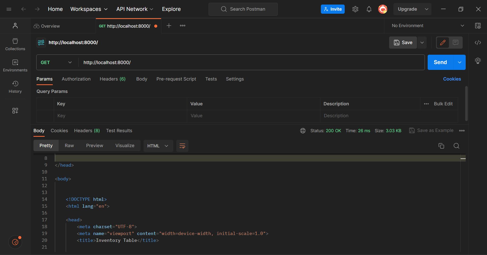
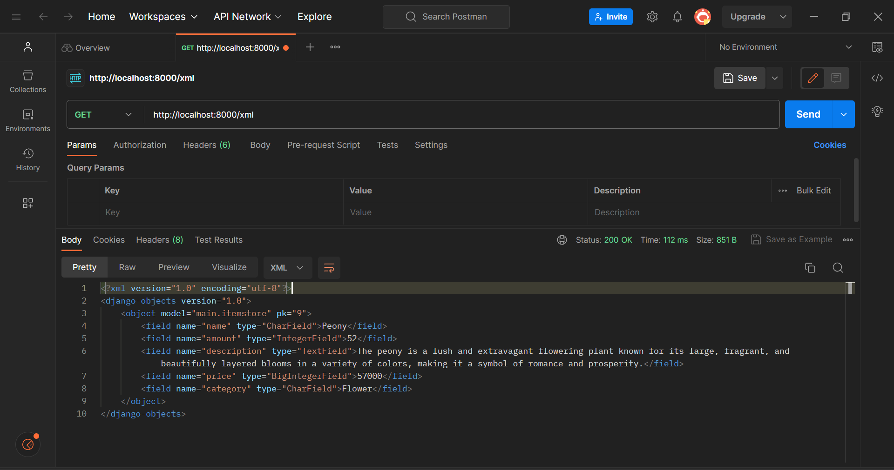
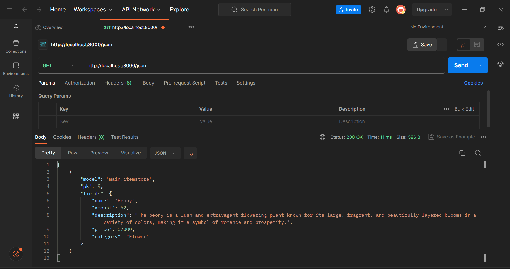
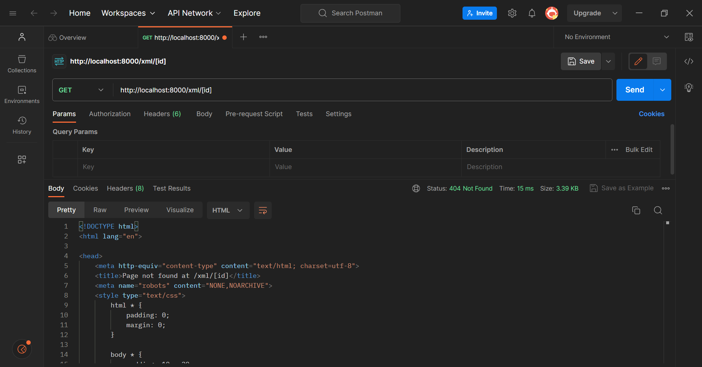
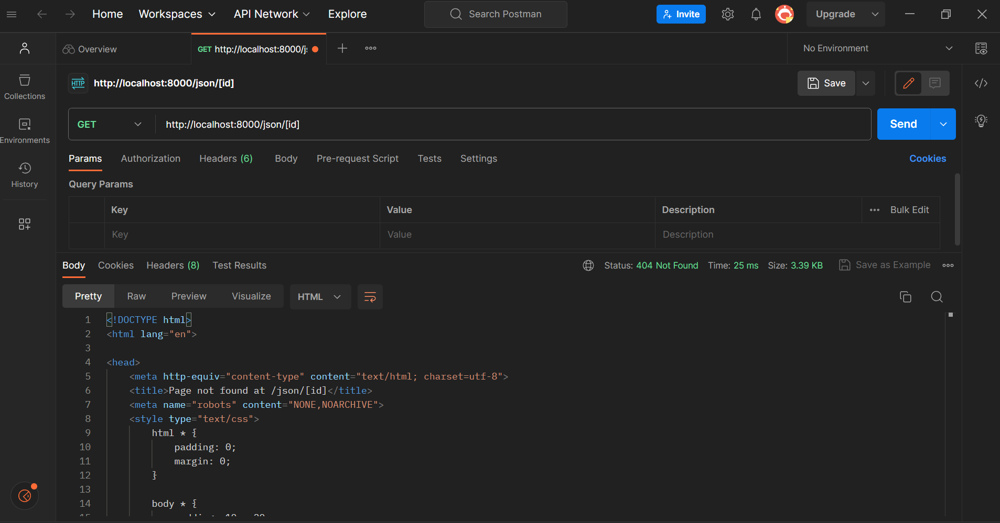

# **Item Insight**

**Pemrograman Berbasis Platform**<br/>
**Tugas 2: Implementasi Model-View-Template (MVT) pada Django**<br/>

**Author**<br/>
Shanti Yoga Rahayu<br/>
2206082360<br/>
PBP D<br/>

Tautan menuju aplikasi Adaptable yang sudah melalui tahap deployment dapat diakses melalui [link ini](https://item-insight.adaptable.app/main/).

## **Membuat Sebuah Proyek Django Baru**
1. Buat sebuah direktori baru sesuai dengan nama yang diinginkan, contohnya `item_insight`. 
2. Di dalam direktori tersebut, buka *command prompt* (Windows) atau *terminal shell* (Linux/Mac).
3. Buat *virtual environment* Python untuk mengisolasi package serta dependencies dari aplikasi sehingga tidak bertabrakan dengan versi lain yang terdapat pada komputer dengan menggunakan perintah berikut.
```
python -m venv env 
```
4. Aktifkan *virtual environment* yang telah dibuat dengan menggunakan perintah berikut. *Virtual environment* yang telah aktif akan ditandai dengan `(env)` pada baris input terminal.
- Windows
```
env\Scripts\activate.bat
```
- Linux/Mac
```
source env/bin/activate
```

5. Buat file `requirements.txt`  di dalam direktori proyek yang sama dan tambahkan daftar *dependencies* yang dibutuhkan dalam file tersebut. Berikut *dependencies* yang akan digunakan dalam proyek.

```txt
django
gunicorn
whitenoise
psycopg2-binary
requests
urllib3
```

6. Install *dependencies* tersebut pada `requirements.txt` dengan menjalankan perintah berikut.
```
python -m pip install -r requirements.txt
```

7. Buat proyek Django dengan nama `item_insight` menggunakan perintah berikut.
```
django-admin startproject item_insight .
```

8. Tambahkan `*` pada `ALLOWED_HOSTS` yang terdapat di dalam `settings.py` yang berada di dalam direktori `item_insight` untuk mengizinkan akses dari semua host. Perlu diingat untuk menggunakan pengaturan ini dengan bijak dan hanya dalam situasi tertentu, seperti saat melakukan uji coba atau tahap awal pengembangan
```python
...
ALLOWED_HOSTS = ["*"]
...
```

9. Pastikan bahwa berkas 'manage.py' terdapat pada direktori yang aktif pada shell kamu saat ini. Di dalam direktori utama, buka kembali *command prompt* atau *terminal shell*. Jalankan server dengan perintah berikut.
```
python manage.py runserver
```

10. Akses http://localhost:8000 di peramban web untuk melihat animasi roket yang menandakan bahwa pembuatan aplikasi Django telah berhasil.
11. Hentikan server dapat dilakukan dengan menekan tombol `Ctrl+C` pada *command prompt* atau *terminal shell*. 
12. Nonaktifkan *virtual environment* dengan menggunakan perintah `deactivate`.
> [!NOTE]
> Buat `.gitignore` yang berisi file yang tidak diperlukan agar tidak memenuhi space.
Isi dari `.gitignore` adalah sebagai berikut.

```.gitignore
# Django
*.log
*.pot
*.pyc
__pycache__
db.sqlite3
media

# Backup files
*.bak 

# If you are using PyCharm
# User-specific stuff
.idea/**/workspace.xml
.idea/**/tasks.xml
.idea/**/usage.statistics.xml
.idea/**/dictionaries
.idea/**/shelf

# AWS User-specific
.idea/**/aws.xml

# Generated files
.idea/**/contentModel.xml

# Sensitive or high-churn files
.idea/**/dataSources/
.idea/**/dataSources.ids
.idea/**/dataSources.local.xml
.idea/**/sqlDataSources.xml
.idea/**/dynamic.xml
.idea/**/uiDesigner.xml
.idea/**/dbnavigator.xml

# Gradle
.idea/**/gradle.xml
.idea/**/libraries

# File-based project format
*.iws

# IntelliJ
out/

# JIRA plugin
atlassian-ide-plugin.xml

# Python
*.py[cod] 
*$py.class 

# Distribution / packaging 
.Python build/ 
develop-eggs/ 
dist/ 
downloads/ 
eggs/ 
.eggs/ 
lib/ 
lib64/ 
parts/ 
sdist/ 
var/ 
wheels/ 
*.egg-info/ 
.installed.cfg 
*.egg 
*.manifest 
*.spec 

# Installer logs 
pip-log.txt 
pip-delete-this-directory.txt 

# Unit test / coverage reports 
htmlcov/ 
.tox/ 
.coverage 
.coverage.* 
.cache 
.pytest_cache/ 
nosetests.xml 
coverage.xml 
*.cover 
.hypothesis/ 

# Jupyter Notebook 
.ipynb_checkpoints 

# pyenv 
.python-version 

# celery 
celerybeat-schedule.* 

# SageMath parsed files 
*.sage.py 

# Environments 
.env 
.venv 
env/ 
venv/ 
ENV/ 
env.bak/ 
venv.bak/ 

# mkdocs documentation 
/site 

# mypy 
.mypy_cache/ 

# Sublime Text
*.tmlanguage.cache 
*.tmPreferences.cache 
*.stTheme.cache 
*.sublime-workspace 
*.sublime-project 

# sftp configuration file 
sftp-config.json 

# Package control specific files Package 
Control.last-run 
Control.ca-list 
Control.ca-bundle 
Control.system-ca-bundle 
GitHub.sublime-settings 

# Visual Studio Code
.vscode/* 
!.vscode/settings.json 
!.vscode/tasks.json 
!.vscode/launch.json 
!.vscode/extensions.json 
.history
```

## **Membuat Aplikasi dengan Nama Main Pada Proyek Item Insight**
1. Buka command prompt pada direktori utama `item_insight`.
2. Aktifkan virtual environment dengan perintah berikut.
```
env\Scripts\activate.bat.
```
2. Buat aplikasi main dengan perintah berikut sehingga terbentuk direktori baru dengan nama main yang akan berisi struktur awal untuk aplikasi.
```
python manage.py startapp main
```
3. Daftarkan aplikasi main ke proyek dengan membuka berkas `settings.py` dalam direktori proyek `item_insight` dan tambahkan `'main'` pada variabel INSTALLED_APPS.
```
INSTALLED_APPS = [
    ...,
    'main',
    ...
]
```

> [!NOTE]
> Proses routing dijelaskan sekaligus di bawah.

## **Membuat Model Pada Aplikasi `Main` dengan Nama Item dan Memiliki Atribut**
1. Buka berkas `models.py` pada direktori aplikasi `main`.
2. Ubah file `models.py` yang terdapat di dalam direktori aplikasi `main` tersebut untuk mendefinisikan model dengan nama `ItemStore` dan memiliki atribut wajib sebagai berikut.
* `name` sebagai nama item dengan tipe `CharField`.
* `amount` sebagai jumlah item dengan tipe `IntegerField`.
* `description` sebagai deskripsi item dengan tipe `TextField`.<br/>
Tambahkan atribut lainnya sesuai dengan apa yang diinginkan, seperti `price` dan `category`. 
2. Isi file `models.py` dengan kode berikut.
```python
from django.db import models

class ItemStore(models.Model):
    name = models.CharField(max_length=255)
    amount = models.IntegerField()
    description = models.TextField()
    price = models.BigIntegerField()
    category = models.CharField(max_length=255)
```

3. Jalankan perintah `python manage.py makemigrations` untuk membuat migrasi model. `makemigrations` akan membuat berkas migrasi yang berisi perubahan model yang belum diaplikasikan ke dalam basis data.

4. Jalankan perintah `python manage.py migrate`.`migrate` akan mengaplikasikan perubahan model yang tercantum dalam berkas migrasi ke basis data.

> [!IMPORTANT]
> Setiap kali melakukan perubahan pada model, seperti menambahkan atau mengubah atribut, perlu melakukan migrasi untuk merefleksikan perubahan tersebut.

## **Membuat Sebuah Fungsi Pada `views.py` untuk Dikembalikan ke Dalam Sebuah Template HTML**
1. Buat direktori baru dengan nama `templates` di dalam direktori aplikasi `main`.
2. Buka direktori `templates` yang telah dibuat. Di dalam direktori tersebut buat file baru dengan nama `main.html`.
3. Buka file `views.py` yang terdapat di dalam direktori `main` dan tambahkan baris kode berikut di bagian paling atas. Kode berikut berguna untuk mengimpor *fungsi render* dari modul `django.shortcuts` yang akan digunakan dalam proses rendering tampilan HTML dengan menggunakan data yang diberikan.
```
`from django.shortcuts import render`. 
```
3. Buat fungsi `show_item` dengan parameter `request` yang di dalamnya terdapat sebuah dictionary `context`. Dictionary `context` berisikan data yang akan dikirimkan ke tampilan. Selanjutnya, tambahkan fungsi `render` yang memiliki tiga argumen, yaitu `request` (objek permintaan HTTP yang dikirim oleh pengguna), `"main.html"` (nama file HTML yang akan digunakan untuk proses *rendering* tampilan), dan `context` (dictionary yang berisi data untuk digunakan dalam tampilan yang dinamis). Fungsi ini akan mengatur permintaan HTTP dan mengembalikan dengan tampilan yang sesuai.

```python
from django.shortcuts import render

def show_item(request):
    context = {
        'creator' : 'Shanti Yoga Rahayu',
        'id' : 2206082360,
        'class' : 'PBP D',
        'name': 'Peony',
        'amount': 52,
        'description': 'The peony is a lush and extravagant flowering plant known for its large, fragrant, and beautifully layered blooms in a variety of colors, making it a symbol of romance and prosperity.',
        'price': 57000,
        'category':'Flower'
    }

    return render(request, 'main.html', context)
```

4. Buka file `main.html` yang sebelumnya telah dibuat dan ubah pada kode yang sebelumnya dibuat secara statis menjadi kode Django yang sesuai sehingga dapat menampilkan data. Gunakan sintaks Django `{{ }}` untuk menampilkan data dari variabel yang terdapat dalam `context` yang telah dikirimkan oleh fungsi `show_item`.

## **Membuat Sebuah Routing Pada `urls.py` Aplikasi `main` untuk Memetakan Fungsi yang Telah Dibuat pada `views.py`**
1. Buat file `urls.py` di dalam direktori main.
2. Konfigurasi routing URL aplikasi `main` agar aplikasi main dapat diakses melalui peramban web dengan melakukan perubahan pada file `urls.py` yang berada dalam direktori `main`.

```python
from django.urls import path
from main.views import show_item

app_name = 'main'

urlpatterns = [
    path('', show_item, name='show_item'),
]
```
## **Melakukan Routing Pada Proyek agar Dapat Menjalankan Aplikasi `main`**
Agar aplikasi yang dibuat dapat dijalankan, diperlukan konfigurasi routing proyek. 
1. Buka berkas `urls.py` di dalam direktori proyek. 
2. Tambahkan rute yang mengarah ke aplikasi tersebut di dalam file `urls.py` yang berada di dalam direktori proyek.
```
"""
URL configuration

The `urlpatterns` list routes URLs to views. For more information please see:
    https://docs.djangoproject.com/en/4.2/topics/http/urls/
Examples:
Function views
    1. Add an import:  from my_app import views
    2. Add a URL to urlpatterns:  path('', views.home, name='home')
Class-based views
    1. Add an import:  from other_app.views import Home
    2. Add a URL to urlpatterns:  path('', Home.as_view(), name='home')
Including another URLconf
    1. Import the include() function: from django.urls import include, path
    2. Add a URL to urlpatterns:  path('blog/', include('blog.urls'))
"""
from django.contrib import admin
from django.urls import path, include

urlpatterns = [
    path('admin/', admin.site.urls),
    path('main/', include('main.urls')),
]
```

## **Melakukan Deployment ke Adaptable**
1. Akses link [Adaptable.io](https://adaptable.io/) melalui peramban web, kemudian buat akun [Adaptable.io](https://adaptable.io/) dengan menggunakan akun GitHub yang digunakan untuk membuat proyek.
2. Setelah berhasil masuk ke [Adaptable.io](https://adaptable.io/), tekan tombol `New App`dan pilih *option* `Connect an Existing Repository`.
3. Hubungkan [Adaptable.io](https://adaptable.io/) dengan GitHub dengan memilih `All Repositories` pada proses instalasi.
4. Pilih repositori proyek aplikasi yang telah berhasil diunggah ke GitHub sebagai basis aplikasi yang akan dilakukan proses *deployment* dan branch yang ingin dijadikan sebagai deployment branch..
5. Pilih `Python App Template` sebagai template deployment.
6. Pilih `PostgreSQL` sebagai tipe basis data yang akan digunakan.
7. Sesuaikan versi Python dengan spesifikasi aplikasi yang akan dilakukan proses `deployment`. Nyalakan virtual environment dan jalankan perintah `python --version` untuk mengecek versi Python yang terdapat pada komputer.
8. Pada bagian `Start Command`, jalankan perintah `python manage.py migrate && gunicorn (main directory).wsgi`.
9. Masukkan nama aplikasi yang nantinya juga akan menjadi nama domain situs web aplikasi sesuai keinginan.
10. Centang bagian `HTTP Listener on PORT` dan tekan tombol `Deploy App` untuk memulai proses *deployment* aplikasi.

## **Bonus: Testing**
1. Buat file testing tambahan pada file `tests.py`.
```python
from django.test import TestCase, Client

class mainTest(TestCase):
    def test_main_url_is_exist(self):
        response = Client().get('/main/')
        self.assertEqual(response.status_code, 200)

    def test_main_using_main_template(self):
        response = Client().get('/main/')
        self.assertTemplateUsed(response, 'main.html')

    def test_item_store_create(self):
        item = ItemStore.objects.create(
            name= 'Peony',
            amount= 52,
            description= 'The peony is a lush and extravagant flowering plant known for its large, fragrant, and beautifully layered blooms in a variety of colors, making it a symbol of romance and prosperity.',
            price= 57000,
            category='Flower',
        )
        self.assertEqual(item.name, 'Peony')
        self.assertEqual(item.amount, 52)
        self.assertEqual(item.description, 'The peony is a lush and extravagant flowering plant known for its large, fragrant, and beautifully layered blooms in a variety of colors, making it a symbol of romance and prosperity.',)
        self.assertEqual(item.price, 57000)
        self.assertEqual(item.category, 'Flower')
```
2. Jalankan tes dengan menggunakan perintah berikut.
```
python manage.py test
```
3. Contoh dari *unit testing* yang berhasil dilakukan sebagai berikut.

```
Found 3 test(s).                                 
Creating test database for alias 'default'...
System check identified no issues (0 silenced).
...
----------------------------------------------------------------------
Ran 3 tests in 0.055s

OK
Destroying test database for alias 'default'...```
```

Berikut penjelasan singkat tentang terkait kode tersebut:

1. `test_main_url_is_exist`:
   - Fungsi ini bertujuan untuk memeriksa apakah URL `/main/` dalam aplikasi Anda dapat diakses dengan benar (status code 200). 
   - Langkah-langkah yang digunakan adalah dengan membuat objek `Client()` yang digunakan untuk membuat permintaan HTTP simulasi, menggunakan objek `Client()` untuk melakukan permintaan GET ke URL `/main/`, dan memeriksa apakah respons dari permintaan tersebut memiliki status kode 200 (OK).

2. `test_main_using_main_template`:
   - Fungsi ini bertujuan untuk memastikan bahwa saat mengakses URL `/main/`, template yang digunakan adalah `main.html`. Langkah-langkah yang digunakan adalah membuat objek `Client()` yang digunakan untuk membuat permintaan HTTP simulasi, menggunakan objek `Client()` untuk melakukan permintaan GET ke URL `/main/`, dan memeriksa apakah template yang digunakan dalam respons sesuai dengan `main.html`.

3. `test_item_store_creation`:
   - Fungsi ini bertujuan untuk menguji pembuatan objek `ItemStore` dengan nilai-nilai yang ditentukan.
   - Langkah-langkah yang digunakan adalah membuat objek `ItemStore` dengan atribut-atribut yang telah ditentukan seperti `name`, `amount`, `description`, `price`, dan `category`. Langkah selanjutnya adalah memeriksa apakah atribut-atribut objek `ItemStore` sesuai dengan nilai-nilai yang telah diatur.

*Unit test* ini dapat digunakan untuk memastikan bahwa URL `/main/` dapat diakses dengan benar, bahwa template `main.html` digunakan, dan bahwa objek `ItemStore` dapat dibuat dengan benar sesuai dengan nilai-nilai yang diinginkan. *Unit testing* berguna untuk memastikan bahwa kode yang dibuat dapat berfungsi dengan benar dan menghindari adanya bug yang tidak terdeteksi.

## **Bagan Client Request and Response - Django**

Berikut ini adalah penjelasan bagan di atas:
1. Pengguna *(client)* membuka peramban web untuk mengunjungi situs web.
2. Pengguna *(client)* masuk ke situs web dan *web server* melayani permintaan *(request)* dari pengguna *(client)*.
3. WSGI melakukan pemrosesan server HTTP untuk situs web yang menggunakan bahasa pemrograman Python.
4. Middleware berperan sebagai perantara untuk mengintegrasikan teknologi yang digunakan dalam proyek untuk mengelola permintaan *(request)*.
5. URL Router mengarahkan alamat proyek sesuai dengan permintaan *(request)* dari pengguna *(client)* yang didefinisikan dalam `urls.py` dan kemudian mengarahkannya ke fungsi yang terdapat di dalam `views.py`.
6. Views (views.py) bertanggung jawab untuk mengatur isi yang akan ditampilkan dalam template HTML. Data yang diolah diambil dari basis data yang telah diorganisir dengan menggunakan ORM dalam `models.py`.
7. Context processor mengirimkan data berisikan informasi dari views.py ke dalam template HTML.
8. Template HTML menampilkan *interface* proyek sesuai dengan data konteks yang dikirimkan dari views.py dan mengikuti logika yang diatur oleh template tags.
9. Middleware berperan sebagai perantara untuk mengintegrasikan teknologi yang diterapkan dalam proyek untuk mengelola *response*.
10. WSGI melakukan pemrosesan server HTTP untuk situs web yang menggunakan bahasa pemrograman Python.
11. Web server melayani *response* dari server dan mengirimkannya ke pengguna *(client)*.
12. Pengguna *(Client)* menerima hasil *response* yang dikirimkan oleh web server.

## **Penjelasan Mengapa Kita Perlu Menggunakan *Virtual Environment*?**
*Virtual environment* adalah sebuah *tool* yang diperlukan untuk memisahkan dependensi yang diperlukan oleh proyek berbeda dengan membuat lingkungan virtual Python terisolasi untuk proyek tersebut. Python kurang baik dalam manajemen *dependency* sehingga apabila perintah kurang spesifik, maka pip akan menginstal semua paket eksternal ke dalam direktori yang disebut 'site-packages' dalam instalasi dasar Python. Dengan menggunakan *virtual environment*, maka dependensi untuk setiap proyek tidak akan saling bersinggungan atau saling mengganggu sehingga dapat meminimalisir konflik dan masalah kompatibilitas yang mungkin terjadi.

*Virtual environment* juga membantu pihak *developer* dalam mengelola dependensi proyek secara lebih efisien. *Developer* dapat menggunakan file `requirements.txt` yang berisi daftar dependensi yang diperlukan dari suatu proyek yang dijalankan dalam *virtual environment* tertentu agar pihak yang terlibat dalam proyek tersebut dapat mengetahui daftar dependesi yang diperlukan dengan mudah dan konsisten. Contohnya, sebuah platform hosting seperti `Adaptable` dapat secara otomatis mengidentifikasi dependensi yang dibutuhkan untuk menjalankan server melalui file `requirements.txt`.  Hal ini juga memberikan kemudahan dalam pengelolaan repositori, di mana pengguna tidak perlu melakukan push direktori    `virtual environment` yang dapat menghabiskan banyak ruang penyimpanan dalam repositori atau host karena semua dependensi telah tercatat dengan jelas dalam berkas `requirements.txt` dan dapat diabaikan dengan menggunakan file .gitignore.


Sebagai contoh, sebuah mesin host seperti `Adaptable` dapat mengetahui dependensi yang harus digunakan untuk menjalankan server melalui file `requirements.txt`. Akan tetapi, *virtual environment* umumnya memerlukan cukup banyak ruang penyimpanan di repository atau host sehingga dapat dihindari dengan mengecualikannya menggunakan '.gitignore'.

## **Apakah kita tetap dapat membuat aplikasi web berbasis Django tanpa menggunakan *virtual environment*?**
Ya, kita tetap dapat membuat aplikasi web berbasis Django tanpa menggunakan *virtual environment*. Akan tetapi, hal tersebut sangatlah tidak disarankan, terutama jika aplikasi web tersebut direncanakan untuk di-*hosting* secara online. Apabila proyek hanya akan dijalankan secara lokal pada komputer pribadi, maka memungkinkan penggunakan environment Python bawaan (root) dan menginstal semua dependensi proyek ke dalamnya. Namun, jika proyek aplikasi tersebut ingin di-*hosting* menggunakan layanan *hosting* online seperti Adaptable, maka akan berisiko mengalami masalah serius dalam mengelola dependensi aplikasi. Server hosting akan menggunakan daftar dependensi yang terdapat dalam file `requirements.txt` untuk mengetahui dependensi yang dibutuhkan. Apabila *virtual environment* tidak digunakan, maka proyek aplikasi sangat mungkin tidak berjalan dengan baik di lingkungan hosting tersebut. Dengan demikian, penggunaan *virtual environment* sangat dianjurkan dalam pengembangan aplikasi Django untuk memastikan kelancaran dan konsistensi proyek ketika berada di-*hosting* secara online.

## **Apa itu MVC, MVT, MVVM? Apa saja perbedaan dari ketiganya?**
MVC (Model-View-Controller), MVT (Model-View-Template), dan MVVM (Model-View-Model) merupakan pola desain arsitektur yang digunakan oleh para pengembang *software* untuk merancang dan mengembangkan aplikasi mereka dengan memisahkan tanggung jawab antara visualisasi, pemrosesan, dan manajemen data untuk aplikasi tersebut.

### MVC (Model-View-Controller)
Pola desain MVC membagi aplikasi menjadi tiga aspek utama: Model, View, dan Controller.
#### Model
Model mewakili komponen utama arsitektur yang mengelola data (berhubungan langsung dengan database), logika, dan batasan aplikasi.
#### View
View mewakili komponen yang berkaitan dengan antarmuka pengguna, seperti XML, HTML, dsb. View memvisualisasi data yang dikelola oleh Model dan menawarkan interaksi kepada pengguna.
#### Controller
Controll mewakili komponen yang membangun hubungan antara Model dan View dengan mengontrol alur data dalam aplikasi. Controller berperan dalam menangani permintaan user, mengolahnya, mengirimkannya ke Model untuk memperbarui atau mengambil data yang diperlukan, dan mengontrol View untuk memberikan tampilan yang sesuai.

###  MVT (Model-View-Template)
#### Model
Model mewakili komponen yang mengakses dan mengelola data. Komponen ini berhubungan langsung dengan database dan bertanggung jawab untuk memelihara seluruh data aplikasi termasuk menentukan struktur data dan menyediakan berbagai mekanisme untuk menambah, memperbarui, membaca dan menghapus data dalam database.
#### View
View mewakili komponen pengendali yang menerima permintaan HTTP, memprosesnya, dan mengembalikan respons HTTP. View mengambil data yang diperlukan untuk memenuhi permintaan menggunakan Model dan menampilkannya di antarmuka pengguna menggunakan Template. Komponen ini juga berperan dalam menciptakan halaman HTML menggunakan template HTML secara dinamis dan mengisinya dengan data yang diambil dari Model.
#### Template
Template adalah berkas yang mendefinisikan struktur atau tata letak yang berkaitan dengan antarmuka pengguna. Template terdiri dari bagian statis dari keluaran HTML yang diinginkan serta beberapa sintaksis khusus yang menjelaskan bagaimana konten dinamis akan disisipkan.

### MVVM (Model-View-Model) 
#### Model
Model mewakili model domain aplikasi, yang mencakup model data dan logika aplikasi. Model dapat berupa Plain Old Java Object (POJO), Kotlin Data Classes, dll. Dalam MVVM, Model dan ViewModel akan bekerja bersama dan berkoordinasi untuk mengelola data.
#### View
View mewakili komponen yang mengatur tampilan antarmuka pengguna. View berperan dalam memberitahu ViewModel terkait interaksi yang dilakukan pengguna sehingga dapat memberikan tampilan yang sesuai. 
#### ViewModel
ViewModel adalah komponen penghubung antara View dan Model. ViewModel di MVVM bertindak seperti pengontrol yang bertanggung jawab untuk mengekspos data dari Model ke View untuk menyediakan logika dan respons yang diperlukan sesuai permintaan pengguna.

### **Perbedaan antara MVC, MVT, dan MVVM?**
|               **Kriteria**                   |             **MVC**              |          **MVT**            |             **MVVM**           |
|----------------------------------------------|----------------------------------|-----------------------------|--------------------------------|
| 1. **Terminologi**                           | Model, View, Controller          | Model, View, Template       | Model, View, ViewModel         |
| 2. **Keterkaitan**                           | Controller menghubungkan Model dan View. | Template mengatur tampilan yang dihasilkan dari Model dan diolah oleh View. | ViewModel berfungsi sebagai perantara antara Model dan View. |
| 3. **Data Binding**                          | Biasanya tidak memiliki data binding yang terintegrasi. | Tidak berlaku, karena konsep ini terkait khusus dengan Django. | Mendukung data binding, yang memungkinkan otomatisasi pembaruan tampilan saat data berubah. |
| 4. **Kompleksitas Aplikasi**                 | Cocok untuk aplikasi berukuran sedang hingga besar. | Cocok untuk aplikasi web Django. | Cocok untuk aplikasi berbasis antarmuka pengguna yang kompleks |
| 5. **Popularitas**                           | Salah satu arsitektur desain paling umum digunakan. | Populer dalam pengembangan web Django. | Umum digunakan dalam pengembangan aplikasi berbasis antarmuka pengguna modern yang kompleks. |
| 6. **Testing**                               | Memudahkan pengujian unit dan integrasi. | Memudahkan pengujian tampilan dan logika. | Memudahkan pengujian unit dan tampilan antarmuka |
| 7. **Pengembangan Proyek**                   | Memungkinkan pengembangan bersama karena pemisahan yang jelas. | Memungkinkan pengembangan bersama dalam tim pengembangan web Django. | Memungkinkan pengembangan bersama dengan tim pengembangan *user interface* dan back-end yang berbeda.
| 8. **Responsif terhadap Perubahan**          | Memerlukan perubahan yang signifikan jika perubahan tampilan diperlukan. | Memerlukan perubahan template jika perubahan tampilan diperlukan. | Dapat menangani perubahan tampilan tanpa banyak memengaruhi ViewModel atau Model. |
| 9. **Penggunaan**                            | Komponen dapat digunakan kembali, tetapi lebih tergantung pada implementasi spesifik. | Template dapat digunakan kembali dalam aplikasi Django, tetapi juga tergantung pada implementasi spesifik. | ViewModel dapat digunakan kembali dalam berbagai aplikasi dan proyek dengan sedikit modifikasi. |
| 10. **Kekurangan Utama**                     | Potensial untuk kompleksitas yang tinggi, terutama dalam aplikasi besar. | Potensial untuk kompleksitas dalam manajemen template dan tampilan. | Memerlukan kerangka kerja atau library yang mendukung MVVM, seperti dalam pengembangan aplikasi berbasis antarmuka pengguna. |
| 11. **Dukungan Platform**                    | Cocok untuk berbagai platform. | Terutama digunakan dalam pengembangan web Django. | Umumnya digunakan dalam pengembangan aplikasi berbasis antarmuka pengguna di platform tertentu seperti Android atau aplikasi desktop. |
| 12. **Pengaturan dan Konfigurasi**           | Tergantung pada framework atau bahasa pemrograman yang digunakan. | Memerlukan pengaturan dalam kerangka kerja Django. | Tergantung pada platform dan kerangka kerja yang digunakan. |
| 13. **Ketersediaan Library/Framework**     | Tergantung pada bahasa pemrograman yang digunakan. | Terintegrasi dengan Django. | Dukungan MVVM tersedia dalam banyak kerangka kerja dan platform. |
| 14. **Penggunaan dalam Aplikasi Mobile**   | Memungkinkan penggunaan dalam aplikasi mobile, tetapi biasanya memerlukan adaptasi. | Lebih terkait dengan pengembangan web, tetapi dapat diintegrasikan dalam aplikasi mobile. | Cocok untuk pengembangan aplikasi mobile modern. |
| 15. **Contoh Framework Terkenal**          | Laravel, Ruby on Rails, Spring | Django                        | Angular, Knockout.js, Xamarin  |


## **Referensi**
https://pbp-fasilkom-ui.github.io/ganjil-2024/ <br/>
https://www.geeksforgeeks.org/python-virtual-environment/<br/>
https://csguide.cs.princeton.edu/software/virtualenv#:~:text=In%20a%20nutshell%2C%20Python%20virtual,or%20used%20by%20other%20projects.<br/>
https://realpython.com/python-virtual-environments-a-primer/<br/>
https://www.geeksforgeeks.org/difference-between-mvc-and-mvt-design-patterns/<br/>
https://www.geeksforgeeks.org/difference-between-mvc-mvp-and-mvvm-architecture-pattern-in-android/<br/>
https://medium.com/@ankit.sinhal/mvc-mvp-and-mvvm-design-pattern-6e169567bbad<br/>
https://www.geeksforgeeks.org/mvc-framework-introduction/<br/>
https://www.biznetgio.com/news/apa-itu-mvc<br/>
https://www.geeksforgeeks.org/django-project-mvt-structure/<br/>
https://www.educative.io/answers/what-is-mvt-structure-in-django<br/>
https://www.askpython.com/django/django-mvt-architecture<br/>
https://books.zkoss.org/zk-mvvm-book/8.0/introduction_of_mvvm.html<br/>
https://www.thirdrocktechkno.com/blog/architecture-presentation-patterns-mvc-vs-mvp-vs-mvvm/<br/>
<br/>

# **Tugas 3: Implementasi Form dan Data Delivery pada Django**<br/>

## **Membuat Input Form untuk Menambahkan Objek Model pada App Sebelumnya**
### 1. Atur Routing dari `main/` ke `/`
1. Atur routing `main/` menjadi `/` sehingga dapat langsung mengakses halaman utama tanpa menerima pesan `404 error` jika tidak menambahkan `/main/` secara manual pada URL dengan cara membuka berkas `urls.py` yang ada pada folder inventory_app dan modifikasi path `main/` menjadi `''` pada `urlpatterns` sebagai berikut.
```python
urlpatterns = [
    path('', include('main.urls')),
    path('admin/', admin.site.urls),
]
```
### 2. Implementasi Skeleton sebagai Kerangka Views
Buatlah *skeleton* yang berfungsi sebagai kerangka `views`` dari situs web yang akan dibuat untuk menjaga konsistensi dalam desain situs web dan memperkecil kemungkinan terjadinya redudansi kode dengan langkah-langkah sebagai berikut.

1. Buat folder `templates` pada *root folder* dan buat sebuah berkas baru dengan format HTML bernama `base.html` yang digunakan sebagai *template* dasar secara umum untuk halaman web lain yang terdapat ada dalam proyek. Tuliskan kode berikut sebagai isi dari file `base.html`.
```

<!DOCTYPE html>
<html lang="en">
    <head>
        <meta charset="UTF-8" />
        <meta
            name="viewport"
            content="width=device-width, initial-scale=1.0"
        />
        
        
    </head>

    <body>
        
        
    </body>
</html>
```

2. Buka berkas settings.py yang terdapat di dalam subdirektori `inventory_app`. Perhatikan baris yang mengandung `TEMPLATES` dan modifikasi dengan menambahkan potongan kode berikut:

```
...
TEMPLATES = [
    {
        'BACKEND': 'django.template.backends.django.DjangoTemplates',
        'DIRS': [BASE_DIR / 'templates'], # Tambahkan kode ini
        'APP_DIRS': True,
        ...
    }
]
...
```
3. Buka berkas `main.html` yang terdaat dalam subdirektori `templates` di dalam direktori main. Modifikasi kode yang terdapat pada berkas `main.html` untuk meng-extend dari base.html yang sebelumnya telah dibuat.
```



    ...
    <!-- Kode dalam berkas main.html yang telah dibuat sebelumnya -->
    ...

```

### 3. Membuat Form Input Data dan Menampilkan Data pada HTML
Buat sebuah form sederhana yang akan digunakan untuk meng-*input* data item pada aplikasi agar data baru dapat ditambahkan dan ditampilkan pada halaman utama dengan langkah-langkah berikut.

1. Buat berkas baru bernama forms.py pada direktori main yang nantinya digunakan untuk menerima data item baru. Masukkan kode berikut ini sebagai isi dari berkas `forms.py`:
```
from django.forms import ModelForm
from main.models import ItemStore

class ProductForm(ModelForm):
    class Meta:
        model = ItemStore
        fields = ["name", "amount", "price", "category", "description"]
```
`model = ItemStore` menunjukkan model yang digunakan untuk form, sedangkan `fields = ["name", "amount", "price", "category", "description"]`` menunjukkan field dari model ItemStore yang digunakan untuk form. 

2. Buka berkas `views.py` yang terdapat dalam folder `main` dan import berikut pada bagian paling atas.
```
from django.http import HttpResponseRedirect
from main.forms import ProductForm
from main.models import ItemStore
from django.urls import reverse
```

3. Modifikasi file views.py pada direktori main dengan menambahkan fungsi baru bernama `create_product` yang menerima parameter `request`` untuk menghasilkan formulir yang dapat menambahkan data produk secara otomatis ketika data disubmit dari form sebagai berikut.
```
def create_product(request):
    form = ProductForm(request.POST or None)

    if form.is_valid() and request.method == "POST":
        form.save()
        return HttpResponseRedirect(reverse('main:show_item'))

    context = {'form': form}
    return render(request, "create_product.html", context)

```

4. Modifikasi fungsi `show_item` yang sudah terdapat dalam file `views.py` sehingga menjadi kode sebagai berikut.
```
def show_item(request):
    items = ItemStore.objects.all()
    context = {
        'creator' : 'Shanti Yoga Rahayu',
        'id' : 2206082360,
        'class' : 'PBP D',
        'items_list': items
    }

    return render(request, 'main.html', context)
```

5. Buka berkas `urls.py` yang terdapat dalam direktori `main` dengan meng-*import* fungsi `create_product` yang sebelumnya telah dibuat.
```
from main.views import show_main, create_product
```


6. Modifikasi kode yang terdapat dalam berkas `urls.py`dengan menambahkan path URL data form ke dalam urlpatterns pada `urls.py` di dalam direktori `main` sehingga dapat mengakses fungsi yang sebelumnya sudah di-*import* sebagai berikut.
```
path('create-product', create_product, name='create_product'),
```

7. Buat berkas HTML baru dengan nama `create_product.html` pada direktori `main/templates` dan masukan kode berikut dalam berkas tersebut:
```
 


<h1>Add New Product</h1>

<form method="POST">
    
    <table>
        {{ form.as_table }}
        <tr>
            <td></td>
            <td>
                <input type="submit" value="Add Product"/>
            </td>
        </tr>
    </table>
</form>


```

8. Buka berkas `main.html` yang terdapat dalam direktori `main/templates` dan tambahkan kode berikut dalam `` untuk menampilkan data item dalam bentuk tabel serta tombol yang akan *redirect* ke halaman *form*.
```
...
 <div class="data-app">
        <h1>Item Insight</h1>
        <h3>{{ creator }}</h3>
        <h3>{{ id }}</h3>
        <h3>{{ class }}</h3>
        
    </div>
    <table>
        <thead>
            <tr>
                <th>Name</th>
                <th>Amount</th>
                <th>Description</th>
                <th>Price</th>
                <th>Category</th>
            </tr>
        </thead>
        <tbody>
            <!-- Add table rows with data here -->
            
            <tr>
                <td>{{ item.name }}</td>
                <td>{{ item.amount }}</td>
                <td>{{ item.description }}</td>
                <td>{{ item.price }}</td>
                <td>{{ item.category }}</td>
            </tr>
            
        </tbody>
    </table>

    <a href="">
        <button>
            Add New Product
        </button>
    </a>
</body>
</html>



```
9. Jalankan proyek Django dengan perintah python `manage.py runserver`. Kemudian, buka http://localhost:8000 pada browser web dan tambahkan beberapa data item baru pada halaman utama aplikasi untuk mengecek apakah *form input* telah berfungsi dengan baik.


## **Menambahkan 5 Fungsi `views` untuk Melihat Objek yang Sudah Ditambahkan dalam Format HTML, XML, JSON, XML by ID, dan JSON by ID**
1. Buka `views.py` yang terdapat dalam direktori `main`. Kemudian, modifikasi fungsi `show_item` yang sudah terdapat dalam file `views.py` sehingga menjadi kode sebagai berikut.
```
def show_item(request):
    items = ItemStore.objects.all()
    context = {
        'creator' : 'Shanti Yoga Rahayu',
        'id' : 2206082360,
        'class' : 'PBP D',
        'items_list': items
    }

    return render(request, 'main.html', context)
```
2. Tambahkan *import* `HttpResponse` dan `Serializer` sebagai berikut pada bagian kode paling atas. 

```
from django.http import HttpResponse
from django.core import serializers
```
3. Buat sebuah fungsi baru bernama `show_xml` dengan parameter `request` dan memiliki sebuah variabel yang menyimpan hasil *query* dari data. Selanjutnya, tambahkan return function `HttpResponse` dengan parameter data hasil *query* yang telah diserialisasi menjadi XML. Berikut kode dari fungsi tersebut.
```
def show_xml(request):
    data = ItemStore.objects.all()
    return HttpResponse(serializers.serialize("xml", data), content_type="application/xml")

```
4. Buat sebuah fungsi baru bernama `show_json` dengan parameter `request` dan memiliki sebuah variabel yang menyimpan hasil *query* dari data. Selanjutnya, tambahkan return function `HttpResponse` dengan parameter data hasil *query* yang telah diserialisasi menjadi JSON. Berikut kode dari fungsi tersebut.
```
def show_json(request):
    data = ItemStore.objects.all()
    return HttpResponse(serializers.serialize("json", data), content_type="application/json")
```
5. Buat sebuah fungsi baru dengan nama `show_xml_by_id` yang menerima parameter `request` dan `id` yang memiliki sebuah variabel yang menyimpan hasil *query* dari data dengan id tertentu.  Selanjutnya, tambahkan return function berupa HttpResponse yang berisi parameter data hasil query yang sudah diserialisasi menjadi XML. Berikut kode dari fungsi tersebut.
```
def show_xml_by_id(request, id):
    data = ItemStore.objects.filter(pk=id)
    return HttpResponse(serializers.serialize("xml", data), content_type="application/xml")

```

6. Buat sebuah fungsi baru dengan nama `show_json_by_id` yang menerima parameter `request` dan `id` yang memiliki sebuah variabel yang menyimpan hasil *query* dari data dengan id tertentu.  Selanjutnya, tambahkan return function berupa HttpResponse yang berisi parameter data hasil query yang sudah diserialisasi menjadi JSON. Berikut kode dari fungsi tersebut.
```
def show_json_by_id(request, id):
    data = ItemStore.objects.filter(pk=id)
    return HttpResponse(serializers.serialize("json", data), content_type="application/json")
```
## **Membuat Routing URL untuk Masing-Masing views yang Telah Ditambahkan Pada Poin 2**
1. Buka berkas `urls.py` yang terdapat dalam direktori `main`, kemudian *import* fungsi yang sudah dibuat pada poin 2, yaitu show_xml, show_json, show_xml_by_id, dan show_json_by_id.
2. Modifikasi isi berkas `urls.py` dengan menambahkan *path url* yang di dalam `urlpatterns` untuk mengakses semua fungsi tersebut.

Berikut adalah kode isi dari `urls.py` yang telah dimodifikasi:
```
from django.urls import path
from main.views import show_item, create_product, show_xml, show_json, show_xml_by_id, show_json_by_id

app_name = 'main'

urlpatterns = [
    path('', show_item, name='show_item'),
    path('create-product', create_product, name='create_product'),
    path('xml/', show_xml, name='show_xml'), 
    path('json/', show_json, name='show_json'), 
    path('xml/<int:id>/', show_xml_by_id, name='show_xml_by_id'),
    path('json/<int:id>/', show_json_by_id, name='show_json_by_id'), 
]
```
## **Bonus: Menambahkan Pesan di Atas Tabel Data**
Tambahkan kode berikut ini sehingga ketika halaman web di-*render*, teks dalam elemen <p> akan menjadi pesan yang menampilkan nilai yang bergantung dengan jumlah item yang telah diisi.

```
...
<div class="item-count">
        <p>You have collected a total of {{ items_list|length }} item(s) in this application.</p>
      </div>
    <table>
        <thead>
            <tr>
                <th>Name</th>
                <th>Amount</th>
                <th>Description</th>
                <th>Price</th>
                <th>Category</th>
            </tr>
        </thead>
        <tbody>
            <!-- Add table rows with data here -->
            
            <tr>
                <td>{{ item.name }}</td>
                <td>{{ item.amount }}</td>
                <td>{{ item.description }}</td>
                <td>{{ item.price }}</td>
                <td>{{ item.category }}</td>
            </tr>
            
        </tbody>
    </table>
...
```

## **Perbedaan antara Form POST dan Form GET dalam Django**
POST dan GET merupakan dua metode yang digunakan dalam melakukan *transfer* data antara *browser* dan server web saat mengirim informasi melalui form HTML. Metode POST digunakan untuk men-*transfer* data dari browser ke server web dengan tingkat keamanan yang lebih tinggi karena informasi dikirim sebagai bagian dari badan permintaan HTTP, sehingga data tersebut tidak terlihat oleh pengguna selama proses pengiriman. Sementara itu, metode GET mengirim informasi sebagai bagian dari URL, sehingga data tersebut dapat dilihat oleh siapa pun yang melihat URL tersebut. 

Perbedaan lebih jelas antara kedua metode tersebut dapat dilihat pada tabel berikut:

| Kriteria                 | Form POST                                              | Form GET                                               |
|--------------------------|-------------------------------------------------------|--------------------------------------------------------|
| Jenis Request            | Mengirim data ke server dalam tubuh permintaan HTTP   | Mengirim data ke server melalui URL                   |
| Keamanan                | Lebih aman karena data tidak terlihat di URL         | Kurang aman karena data terlihat di URL               |
| Panjang Data             | Tidak ada batasan panjang data yang dapat dikirimkan  | Batasan panjang data yang dapat dikirimkan oleh URL   |
| Penggunaan              | Digunakan untuk mengirim data sensitif seperti kata sandi atau data yang akan dimasukkan ke dalam database | Digunakan untuk permintaan yang bersifat idempoten (tidak mengubah data) atau permintaan yang dapat di-bookmark |
| Contoh Penggunaan       | Mengirimkan formulir pendaftaran dengan data pribadi  | Membaca parameter pencarian pada halaman hasil pencarian |
| Implementasi Django     | Menggunakan `request.POST` dalam Django             | Menggunakan `request.GET` dalam Django                |
| Kecepatan Akses URL     | Lebih lambat karena data tersembunyi dalam tubuh permintaan HTTP | Lebih cepat karena data terletak dalam URL dan dapat diakses langsung |
| Penanganan Data Ganda   | Dapat mengatasi data ganda dengan baik                | Tidak dapat mengatasi data ganda dengan baik          |


## **Perbedaan Utama antara XML, JSON, dan HTML dalam Konteks Pengiriman Data**
Perbedaan utama antara ketiga format yang digunakan dalam konteks pengiriman data tersebut adalah XML digunakan untuk representasi data hierarkis dan terstruktur, JSON untuk pertukaran data data antar aplikasi yang biasanya mudah dibaca oleh manusia, dan HTML untuk pembuatan tampilan halaman web.

Perbedaan lebih jelas antara kedua metode tersebut dapat dilihat pada tabel berikut:
| Kriteria                   | XML                                    | JSON                                    | HTML                                |
|----------------------------|----------------------------------------|----------------------------------------|-------------------------------------|
| Tujuan Utama               | Representasi data hierarkis            | Pertukaran data antar aplikasi         | Membuat konten web                  |
| Struktur Data              | Struktur hierarkis yang menggunakan tag | Struktur data yang berbasis objek     | Struktur dokumen tata letak web     |
| Keterbacaan               | Tidak terlalu mudah dibaca oleh manusia | Mudah dibaca oleh manusia             | Tidak terlalu mudah dibaca oleh manusia |
| Ukuran Data               | Lebih besar karena menggunakan tag     | Lebih kecil karena format ringkas     | Lebih kecil karena fokus pada tampilan |
| Pemrosesan Data           | Memerlukan pemrosesan untuk ekstraksi dan manipulasi data | Memerlukan pemrosesan untuk ekstraksi dan manipulasi data | Pemrosesan oleh peramban web       |
| Penggunaan Utama          | Konfigurasi, penyimpanan, dan pertukaran data berstruktur | Pertukaran data antar aplikasi, API web | Membuat halaman web                  |
| Contoh Penggunaan         | Konfigurasi file, data berbasis markup | Pertukaran data antar server dan klien dan RESTful API | Pembuatan halaman web dan tampilan konten |

## **Alasan JSON Sering Digunakan dalam Pertukaran Data antara Aplikasi Web Modern?**
JSON (JavaScript Object Notation) sering digunakan dalam pertukaran data antara aplikasi web modern karena memiliki format yang ringkas dan mudah dibaca oleh manusia, yang membuatnya sangat mudah dipahami oleh pengembang dan memudahkan mereka untuk memeriksa data. JSON bekerja dengan baik dengan bahasa pemrograman yang berbasis objek, seperti JavaScript, Python, dan banyak bahasa lainnya sehingga memungkinkan aplikasi untuk mengonversi data ke objek dalam memori dengan mudah dan kompatibel dengan berbagai platform dan sistem operasi. Kemampuan JSON untuk mendukung struktur data yang bersarang *(nested)* memungkinkan representasi data yang kompleks dan hierarkis. Selain itu, JSON juga telah menjadi standar de facto untuk API web RESTful, yang merupakan fondasi banyak aplikasi web modern sehingga memudahkan interoperabilitas dan pertukaran data antar aplikasi secara luas. 

## **Mengakses Kelima URL di Poin 2 Menggunakan Postman dan Membuat Screenshot dari Hasil Akses URL Pada Postman**
1. Jalankan proyek Django dengan perintah `python manage.py runserver`.
2. Buka Postman dan buat sebuah request baru dengan method `GET` dengan beberapa url untuk mengetes apakah data terkirimkan dengan baik.
### HTML (http://localhost:8000)

### XML (http://localhost:8000/xml)

### JSON (http://localhost:8000/json)

### XML by ID (http://localhost:8000/xml/[id])

### JSON by ID (http://localhost:8000/json/[id])



## **Referensi**
https://pbp-fasilkom-ui.github.io/ganjil-2024/ <br/>
https://blog.finxter.com/get-post-in-django-made-easy/<br/>
https://docs.djangoproject.com/en/4.2/topics/forms/#:~:text=GET%20and%20POST%20are%20typically,the%20state%20of%20the%20system. <br/>
https://medium.com/@oazzat19/what-is-the-difference-between-html-vs-xml-vs-json-254864972bbb <br/>
https://www.deltaxml.com/blog/xml/whats-the-relationship-between-xml-json-html-and-the-internet/ <br/>
https://thenewstack.io/why-fast-json-analytics-is-foundational-for-modern-web-apps/ <br/>